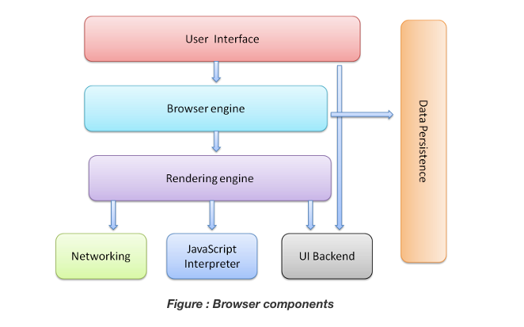

# Workbook T1A1
## Link to Assignment
Github: https://github.com/james-mcgregor100/JamesMcGregor_T1A1
&nbsp;  
&nbsp;  
&nbsp;  

# Questions - 
## **Question 1 - Identify and explain common and important components and concepts of web development markup languages**
Web development markup languages are different from computer programming languages. Web development markup languages are languages which arranges the elements on a page, and decides how the page's elements should be formatted. 

&nbsp;
&nbsp;    
### **HTML**
HTML stands for Hyper Text Markup Language, which is the language which which allows the user to view all webpages in a web browser. The role of HTML is to visually display data on a web page, which differentiates HTML from other markup languages, as will be explained in the paragraphs below. The HTML language provides web pages with meaning, and achieves this by assigning specific HTML elements to the content which is being displayed on the web browser. For example, when an ordered list of items needs to be displayed, the HTML will use a specific element called "ordered list" to assign it to the list of items. The HTML languages uses something called a "tag" which is what encapsulates or wraps the piece of text, and the tag is assigned a specific element depending on what element the web developer would like to implement. Another important feature of the HTML language is its way of assigning specific areas of the website (top, bottom, left, right, center) to specific elements. This helps to provide a general structure for how the page will be displayed, and provides meaning to the developer and the user. 
&nbsp;  
&nbsp;     
On all HTML pages, there are a number of specific HTML components which must be used to provide a basic structure to the website, before more specific elements are added. 

#### ***Source - https://developer.mozilla.org/en-US/docs/Learn/Getting_started_with_the_web/HTML_basics***
&nbsp;  
The snippet above shows the basic layout of a HTML webpage, with the most fundamental elements included. Firstly, the !DOCTYPE html tag tells the code editor that the document is a HTML document. The <html> tag is used to wrap the whole page in HTML language. The roll of the <head> tag is to have a title (<title> tag) which will display a page title on the tabs of a browser window. And the <meta> tag communicates to the code editor what language the code is being written in. 

Outside of the this are the <body> and <image> tags. The body element holds all of the information for the page inside of it, from the top to the bottom of the page. And the <image> obviously wraps around an image of a link so that it can be displayed in the HTML document. 
&nbsp;  
&nbsp;  
One of the main components that can be found in HTML pages are "links". The HTML pages are able to display hyperlinks in the html file which allows users to navigate from one page to another. An example of a "link" component in HTML is presented below - 

The HTML markup language also has a range of other components, including: 

&nbsp;  
&nbsp;
### **XML**
&nbsp;  
&nbsp;
### **SGML** 
&nbsp;  
Source - https://developer.mozilla.org/en-US/docs/Web/HTML 
Source - https://www.semrush.com/blog/markup-language/
Source - https://www.howtogeek.com/721685/what-is-a-markup-language/ 
&nbsp;
&nbsp; 
&nbsp;  
&nbsp;  

## **Question 2 - Define the features of the following technologies that are essential in terms of the development of the internet:**
&nbsp;
### **Introduction**
Since the development of the internet in the 1960s, there have been a number of components which have made up the internet that are still a core part of how the internet operates today.
&nbsp;   
&nbsp;  
### **IP addresses (IPv4 and IPv6)**
IP addresses, or Internet Protocols (both IPv4 and IPv6) is an address used by both the end of the sender, and receiver, of information on the internet.

Most people think of the website domain names as being the primary address for a website in the ecosystem of the internet, however, the website domain name is used for reasons of simplicity and expediency. Behind every domain name for a website exists a unique IP address, which is considered to be the actual address for a website. 

The main difference between the IPv4 IP address and the IPv6 IP address is the amount of IP addresses that are able to be created on the network. It is believed that the IPv4 style of IP addresses will eventually run out of space to create new addresses, and this will lead to the adoption of the new, larger scale version of IP addresses, which is known as IPv6. For comparison, the IPv4 style of IP address has approximately ____________ number of IP addresses in the world. Due to the explosion of the human population, increasing technological adoption by the world’s population, and increasing number of computers, the IPv6 style of address will need to be used. It is believed that the IPv6 style will hold approximately _______________ number of addresses, which IT experts believe will be a sufficient amount for the foreseeable future.

 This address is what helps to send information and data accurately from one device at one location, to another device at another location - “Devin Shah, 2009, A Complete Guide to Internet and Web Programming”. If one thinks about this in terms of the development of the internet, the invention of Internet Protocols has allowed the world to become more interconnected technologically, and has allowed for communication barriers to be removed between people around the world. 
&nbsp;  
&nbsp;     
### **Packets**
When one enquires into the information and data being sent to and from these IP addresses in the digital world, it will become apparent that this “data” or “information” is not just an abstract idea. A piece of data is a very real thing, and in order for this data to be able to travel through digital space and time through the internet, it must be broken down into something called “packets”.
&nbsp;   
&nbsp;  
### **Routers and Routing**
The words ‘router’ and ‘routing’ give us clues already as to what they are, and what their function is in relation to the internet. Routers play an integral part of the internet by acting as intermediaries between a sender and a receiver of information, and data. The routers are responsible for initially analyzing the contents of the packets once it arrives at the router, and once analyzed, they are then forwarded on to the next router on the route to its destination. In order for a packet of information to be sent from one computer to another, it must travel along digital pathways, and on these digital pathways there are a number of routers spread at different points throughout the network to receive and forward on data. However, the pathways that data travels from its sender to its receiver do not always occur in straight line from point A to point B, and sometimes data may need be ‘re-routed’ to a router which may branch off in a different direction, and eventually, it will be ‘rerouted’ onwards to its final destination. (Page 37, How the Internet Works by Preston 
Gralla, 1998)
&nbsp;  
&nbsp; 
### **Domains and DNS**
As mentioned above, IP addresses are the addresses which are the actual addresses of websites, and websites have been given domain names in order to help people remember easily how to find a particular website. Try to imagine for a moment if you were required to remember a random string of numbers instead of the phrase ‘www.facebook.com’. It would make remembering website names much more complex if we were to use IP addresses as opposed to domain names. 
An important component of DNS is ‘caching’. Caching is essentially a repository of data on your computer which stores information of previously visited websites. This data is kept on your computer for a fixed amount of time, and allows your computer to open up the cache files to find the details of a website that you are trying to connect to. If your computer does have this data stored in its cache, then it will be able to connect to a website quicker than if it had to find the details of the website externally, which would involve a process of anywhere between five to eight steps in order to successfully fulfill the user’s request. 

## **Explain how each technology has contributed to the development of the internet.**
IP addresses 
(IPv4 and IPv6)
Packets
Routers and Routing

**Domains and DNS**
&nbsp;
&nbsp;  
The emergence and implementation of the Domain Name System was a significant development in the history of the Internet. Initially, all devices connected to the internet were recorded on a .TXT file titled HOSTS.txt. Over time the .TXT file was unable to handle the large amount of records being kept in the file, and subsequently, technologists designed what we now call the Domain Name System to mitigate scalability issues with the HOSTS.txt file. 
&nbsp;  
&nbsp; 
**source** - (Signposts in Cyberspace: The Domain Name System and Internet Navigation, 2005 - page 41, 42 file on my PC*******) 
&nbsp;  
&nbsp;  
**source**What is DNS? – Introduction to DNS - AWS (amazon.com)

## **Question 3 - Define the features of the following technologies that are essential in terms of the development of the internet:**
&nbsp;  
### **TCP**
TCP stands as Transmission Control Protocol, which is a protocol which standardizes, or sets out the method for how data is sent and transmitted across the internet. The Transmission Control Protocol and Internet Protocol (IP) work together in tandem to facilitate the sending, receiving, and travel of data across the internet. The IP address sets out the addresses from the sender and the receiver devices, and the TCP decides how the data will get transmitted throughout the journey of a packet of data, from start to finish.

*Source - https://www.ibm.com/docs/en/aix/7.1?topic=management-transmission-control-protocolinternet-protocol* 
&nbsp;  
&nbsp;  

### **HTTP and HTTPS**
HTTPS is different from HTTP in that it provides a layer of encryption, and thus is more secure than the HTTP protocol. If a similar form were to be submitted on both HTTP and HTTPS, someone attempting to hack the form would find it easier to access the information from the HTTP protocol, and would have trouble accessing the information via HTTPS. The encryption feature in HTTPS is an invaluable tool for websites, as it gives the company running the website an extra layer of trust and reputability.  
**Source** https://www.cloudflare.com/learning/ssl/why-use-https/ 
&nbsp;  
&nbsp;  

##### _Image Source - https://cheapsslsecurity.com/blog/http-vs-https-security-the-differences-between-these-protocols/_
&nbsp; 
From the diagram above, we can see that a HTTP website sends plaintext data over the internet to a website server, however, there is no data encryption taking place. These packets of data being sent over the internet are vulnerable to being exploited by hositle actors. HTTPS websites, on the other hand, encrypt their packets of data when they are sent from the website to the server. HTTPS websites are designed for protecting the user's sensitive data, such as their credit card details, passwords, and other sensitive personal information which should not be shared with third parties. The easiest way to determine whether a website is HTTP or HTTPS is whether or not a small padlock symbol is placed in front of the website's url. If the symbol is present, the website is secure - if there is no symbol, the website is not secure. 
&nbsp;
#### **TLS and SSL Encryption**
The main feature of a HTTPS website which facilitates the encryption process is called "Transport Layer Security", or TLS. Before the TLS protocol was implemented, the Security Socket Layer (SSL) was the main security protocol responsible for providing encryption of data sent over the internet. 

&nbsp;  
&nbsp;

This layer of trust is an important development of 
client and server communication. With the 
development of the internet, the number of  hackers 
has also grown, and therefore, the invention of 
HTTPS is a fundamental feature in the development of
the internet over time. Since the early days of the internet, more and more websites have made the change from HTTP to HTTPS for obvious reasons, and the security protocols layers protecting the HTTPS websites have also gone through its own development.
&nbsp;
&nbsp;

https://kinsta.com/knowledgebase/tls-vs-ssl/ 
https://aboutssl.org/ssl-guide/ 
https://cheapsslsecurity.com/blog/http-vs-https-security-the-differences-between-these-protocols/ 
https://www.globalsign.com/en/blog/ssl-vs-tls-difference 
https://www.cloudflare.com/en-gb/learning/ssl/why-use-https/ 
https://www.acunetix.com/blog/articles/tls-security-what-is-tls-ssl-part-1/ 

### **Web Browsers (requests, rendering and developer tools)**
Web browsers have made many strides in their development since some of the first browsers were developed and used in 1994, such as Mosaic and Nexus. Today, some of the most popular web browsers used are Google Chrome, Internet Explorer, Mozilla Firefox, and Microsoft Edge. 
For a web browser to be able to display contents on the page, there are a series of steps that must take place before the user is able to see the fully loaded web page. There are a range of components which are needed in order for a web browser to work. A list of components which make up the web browser are as follows: 
&nbsp;  
&nbsp;  

##### _Image Source - https://www.html5rocks.com/en/tutorials/internals/howbrowserswork/#Resources_
&nbsp; 
&nbsp; 
### **User Interface**
&nbsp;
The user interface is responsible for displaying what the user can interact with when they open the web browser. The components of the user interface include elements such as toolbars, address bars, and home buttons.  It must be noted here that the user interface does not include the actual web page display. It only includes the components that are in the browser whether a web page loads or not. 
&nbsp;  
&nbsp;  
### **Browser Engine**
The browser engine is located behind the user interface and is considered to be a sort of intermediary which helps to connect the user interface with the rendering engine. 
&nbsp;  
&nbsp; 
### **Rendering Engine**
The rendering engine is responsible for displaying the elements and code which are written in HTML, XML, CSS, and Javascript. In order for the rendering engine to be able to translate the code into a visual display form on the web browser, the rendering engine must complete a  series of steps. The rendering engine is an important component of a web browser, and without it, the user would not be able to view anything upon opening a web page. Each browser uses a different kind of rendering engine, some of the major rendering engines, according to Neild (2020), are: 

- Webkit (used in Safari)
- Gecko (used in Firefox)
- Blink (used in Chrome)
&nbsp;  
&nbsp;

The rendering engine goes through several steps in order to complete the process of rendering, which can be seen in the diagram below: 
&nbsp;  
&nbsp;

### *Image source - https://www.browserstack.com/guide/browser-rendering-engine*

From this diagram we can see that the rendering engine is completing a range of processes to make sure that the web browser is displaying the web page correctly. A basic overview of the steps required (seen in the diagram above) are outlined below: 
&nbsp;    
&nbsp;

1. The HTML must be parsed initially, which means that the HTML code must be interpreted and broken down into small chunks (or nodes) in order to create what is called a DOM tree. The CSS is also constructed into its own tree called the CSSOM.
2. Secondly, render tree is constructed, whereby the rendering engine determine what kind of order the DOM tree will be displayed in. 
3. After construction, the rendering engine moves on to implement the layout of the tree. This is where the engine will decide what the dimensions and layout values are going to be, and it will attempt to make an accurate depiction of what it is instructed to do through the HTML and CSS code. Once the tree has been constructed, the rendering engine moves through the tree from the top of the tree to the bottom, ignoring any elements in the DOM and CSSOM trees which are not required to be displayed. 
4. Once the layout of the tree has been finalized, the rending engine moves onto the last step of painting the rener tree. This involves colorization of pixels, and converts the information in the render tree to actual visible pictures which are visible in the browser (Unadkat 2019)(Grigorik). 
&nbsp;    
&nbsp;  

The rendering engine does not pull the data and code from
any random place, but it is constantly communicating with
the networking component of the web browser in order to 
receive the information to begin rendering. 

**Unadkat (2019)**https://www.browserstack.com/guide/browser-rendering-engine 

**Grigorik** https://developers.google.com/web/fundamentals/performance/critical-rendering-path/render-tree-construction 

Neild (2020) https://www.gizmodo.com.au/2020/12/which-browser-engine-powers-your-web-browsingand-why-does-it-matter/ 
 

https://blog.sessionstack.com/how-javascript-works-the-rendering-engine-and-tips-to-optimize-its-performance-7b95553baeda Zlatkov (2018)
### **Networking**
The networking
layer plays a crucial part in delivering load speed and 
response times when loading web pages, or particular 
elements on web pages. The networking component is used for undertaking requests and calls to the network using protocols such as HTTP. Before making this request, however, web browsers will check to see if the local computer has a HTTP cache, which allows the page to load quicker. If a user has cleared their cache files previously, or if they have never visited a particular website, the networking layer will need to
&nbsp;  
&nbsp;
### **Javascript Interpreter** 
The Javascript intepreter is responsible for implementing the code written in Javascript to be displayed correctly in a web browser. Before the Javascript interpreter allows the Javascript code to be displayed, it must go through a process of evaluating the code to best decide how the 

**Source - Conrad (2018) https://softwareengineeringdaily.com/2018/10/03/javascript-and-the-inner-workings-of-your-browser/**
&nbsp;
&nbsp;
### **UI Backend**
The UI backend component plays the simple roll of displaying and drawing certain elements in the browser, such as check boxs, windows, and widgets. The operating system is what powers this process underneath the UI functions. 

&nbsp;
&nbsp;
### **Data Storage/Persistence**
The data storage component is responsible for storing various types of data related to the user's interactions with web pages through the browser. The browser is able to collect, track, and store the user's data, using different methods of data storage. Some types of data storage include:
&nbsp;  
&nbsp;
- Session storage
- Local storage
- Cookies
 
*source for local storage - https://developer.mozilla.org/en-US/docs/Web/API/Window/localStorage* 

*source for session storage - https://developer.mozilla.org/en-US/docs/Web/API/Window/sessionStorage*

&nbsp;  
The first type of data storage is session storage, where the data is stored in each tab in a browser. If a browser is closed, the data that was entered into or retrieved from the browser will be erased. Session storage thus only provides a temporary form of storage in the browser. Local Storage is similar to session storage, however its expiration date is much longer; it does not expire, even after the user has closed the browser or ended the session.
&nbsp;  
&nbsp;  
Cookies are also a form of storage used to enable faster load times. When  user visits a page, the history of their visit, and their activity on the website is stored in cookies. If the user is to return in the future to the same webpage, these cookies will allow the browser to remember the user, and thus will provide a streamlined experience. The storing of cookies can bring into question possible security risks or data breaches for the user, as they are having their every movement tracked in a web browser. However, over the years browsers and web pages have implemented a permission form that pop-up asking users if they wish to have their cookies stored or not. 

*source - https://www.kaspersky.com/resource-center/definitions/cookies*
&nbsp;  
&nbsp;
### **Developer Tools**
One important feature of web browsers that are used by many developers around the world are the developer tools. The developer tools function in modern day web browsers allows users to inspect the source code that makes up the webpage they are currently viewing. When developers are having problems with certain areas of their code, developer tools allows developers to inspect very specific areas of the web page in order to debug a problem if there is a problem with their code. Developer tools don’t only allow for inspecting code to spot errors or bugs, but they allow for users to change certain elements in the code in real time, and they output the code changes in real time in the browser for the developer to see. 

Steel 2021 https://au.pcmag.com/browsers/85834/30-years-of-browsers-a-quick-history 
About J Query - Web Browsershttps://books.google.com.au/books?id=mRdLDQAAQBAJ&dq=browsers+nexus+mosaic&source=gbs_navlinks_s 
Client and server communication over the internet through web browsers occurs when a client and a server are required to interact with each other. In the case of the web, clients are considered to be computers or devices, and servers are the servers in the backend of the web applications where data is stored. The client interacts with the browser by giving it a command or a request, and the browser subsequently relays that information (if necessary) to the server on the other end. The server then 
https://developer.mozilla.org/en-US/docs/Learn/Getting_started_with_the_web/How_the_Web_works 

Explain how each technology has contributed to the development of client and server communication over the internet (50 - 150 words for each technology)
Client-Server Model - an overview | ScienceDirect Topics
https://www.browserstack.com/guide/browser-rendering-engine - Browser Source - Unadkat (2019)
https://plg.uwaterloo.ca/~migod/papers/2006/jsme-browserRefArch.pdf - A reference Architecture for Web Browsers - Alan Grosskurth
&nbsp;  
&nbsp;  
## **Q4 Identify THREE data structures used in the Ruby programming language and explain the reasons for using each.**
Data structures in programming languages contain collections of data, big or small, and have a number of uses. Primarily, the data structures that hold groups of data are there for someone to access the data, retrieve a piece of data, delete a piece of data, or add a piece of data. In programming, there are more than one way to store and collate data, and these different methods of structuring and storing data are called “data structures”. Three commonly known data structures in the Ruby programming language are: arrays, hashes, and binary trees. 
&nbsp;  
&nbsp;  
### **Arrays**
&nbsp;
#### **Identify**
Arrays are a data structure which holds a list of variables in an index. The 
An important note to make about arrays is that they are not the same as arrays in other programming languages. Arrays in other programming languages are considered to be static, while arrays in Ruby are considered to be dynamic. This means that static arrays in other programming languages must input the specific size of the array when it is first being added, and its size cannot be modified once it has been created. However, in Ruby’s case, a dynamic array is able to be modified and changed, long after the array has been created. 
A basic array data structure may look something like this:
&nbsp;  
&nbsp; 

Countries = [Australia, Japan, China, Germany] 
&nbsp;   
&nbsp;
&nbsp;  
The elements within an array are ordered in an index, and they are automatically ordered starting from 0 (zero). This allows for data retrieval of particular elements within the array simply by calling upon the index number in the index. In the above example the index would look like this - 
&nbsp;  
&nbsp;  
[0, 1, 2, 3,] 
&nbsp;  
&nbsp;  
#### **Explain the Reasons**
Arrays are an important data structure to use in programming as they allow the program to hold blocks of important data, which contain many elements. Storing many elements in one index allows the program to access, retrieve or store large amounts of data, and to locate specific pieces of data accurately and easily. Arrays store data in a numerical order, starting from zero. Therefore, it is easy for a piece of data to be located in the array as it has its own unique location among the other data in the array. This can be very convenient when needing to retrieve specific data objects from an array.

Arrays are a particularly great data structure to use to store a group of data that are related to each other. For example, if a program were created about selling animals online, an array may be used to store the data of all dog breeds, or all cat breeds that are bought and sold on the website or application. Moreover, arrays only use one variable to give a value to the array, as opposed to a 
list of individual variables, this uses less memory in the program and allows for faster search times.

Another reason why an array may be a better option over another data structure is because of its ability to be two dimensional. 

A possible reason for deciding not to use arrays could be because of an array’s fixed size, and it’s fixed memory. Unfortunately, if extra data needed to be added to the array

Source for Arrays - https://w3.cs.jmu.edu/spragunr/CS240_F12/ConciseNotes.pdf - page 10-page 11 
Source for Arrays - https://www.google.com.au/books/edition/Learning_Ruby/pYS_Fm5LqUYC?hl=en&gbpv=1&dq=introduction+to+ruby&printsec=frontcover page 93 
Source for Arrays - https://www.google.com.au/books/edition/Ruby_Programming_for_Beginners/3lWSzQEACAAJ?hl=en - page 142 

### **Hashes**
Hashes are similar to arrays, in that they store a group of data. There are two main diffences between hashes and array. Firstly, the elements within an array do not need to be assigned a value or key. Secondly, the hashes are in an unordered index, unlike arrays. For a hash to be correctly written in code, the elements within the hash must be assigned both a value and a key. The keys and values within the hashes are called upon when writing the code to retrieve a piece of data from within the hash. Acording to Castello (2020) some basic use cases for hashes include: listening vocabulary in languages which provide a varieyty of definitions. Each definition would be a new value/key pair. Also, lists of people's names, or usernames. 
Here is a basic example of what a basic hash data structure may look like: 

Days = {"1" => “ Monday”, "2" => “Tuesday”, "3" => “Wednesday”, "4" => “Thursday”}

Similar to arrays, hashes also use an index to allow retrieval of individual data items. If a specific value from the hash index was required for retrieval, a similar process to the arrays takes place A basic example of this is below: 

## *********insert example here of retrieving a value from hash index.******

*Source for hashes - https://www.google.com.au/books/edition/Learning_Ruby/pYS_Fm5LqUYC?hl=en&gbpv=1&dq=introduction+to+ruby&printsec=frontcover - Chapter 7, page 107*

*Source for hashes -https://books.google.com.au/books/about/Ruby_Programming_for_Beginners.html?id=3lWSzQEACAAJ&redir_esc=y* page 158 

*Castello (2020) - https://www.rubyguides.com/2020/05/ruby-hash-methods/* 

### **Trees**
&nbsp;
&nbsp;  
Trees are another common data structure in the Ruby programming language, and they play a similar role as an array and hash data structure. However, trees are different from arrays and hashes by the way that they store and structure the stored data in a non-linear way. A tree data structure is a top down structure, unlike the arrays and hashes which are left to right. The tree is structured with a root at the very top, and with nodes branching off the root below to the left, and to the right. The nodes which branch off the branches above are called children, as they are descendents of the branches above. Because the tree is structured literally like the structure of a tree in the real world, the term used for searching the tree is "tree traversal", which is different from searching a linear index like a hash or an array. 

A reason for using a tree over a linear data structure such as a hash or an array is because the tree traversal takes a short amount of time to insert and delete data. On the other hand, trees may become lopsided (on the left or the right side) and this could lead to problems with the data structure. 

*Source https://www.programiz.com/dsa/trees*
Source for Trees - https://w3.cs.jmu.edu/spragunr/CS240_F12/ConciseNotes.pdf - page 93
http://www.cs.uni.edu/~wallingf/teaching/agile-may2010/ruby/programming-ruby.pdf (page 14 for hashes and arrays)
https://www.rubyguides.com/2019/04/ruby-data-structures/ 
https://www.google.com.au/books/edition/Computer_Science_Programming_Basics_in_R/T84ocHBqvEUC?hl=en&gbpv=0 
## **Question 5 -  Describe the features of interpreters and compilers and how they are different.**
Computers programs are written using high-level language, meaning its language is close to human languages, more specifically, the English language (among others). The problem with computer programs being written in high-level language is that computers are not able to understand this type of language. Therefore, computers require programs called *interpreters* and *compilers* to convert the high-level language code , into low-level language code, otherwise known as "machine language".
&nbsp;  
&nbsp;
### **Features of Compilers and Interpreters**
 According to Interviewbit (2022), interpreters and compilers share similar features, with some exceptions. 
&nbsp;  
&nbsp;  

*Source https://www.guru99.com/compiler-design-phases-of-compiler.html* 

### **Differences betwen Interpreters and Compilers**
&nbsp;
&nbsp;
#### **Method Used**
The primary difference between interpreters and compilers is the method that each use to convert the program into code. In the case of the compiler, the program is analyzed, and the whole program is converted in code in one setting. This is distinctly different to the interpreter which analyzes small chunks of the program, and converts them into code, one by one. Because the interpreter is constantly analyzing the program line by line, it is providing feedback of any errors that may occur every step of the way (Tripathi 2021). However, because the compiler analyzes and converts the program into code from start to finish in one setting, any errors that are present in the lines of code will not show up until the compiler has finished the conversion (Tripathi 2021).  
&nbsp;
&nbsp;
#### **Execution Speed**
Since the interpreter and compiler both use different methods to convert the source code into machine code, the duration of the conversion varies markedly between the two. Interpreters are able to translate source code quickly, however, because the interpreter stops at each line, the overall conversion time is long. The compiler, on the other hand, is slower to initially translate the source code, but overall duration time is faster, because it does not stop to scan errors line by line like the interpreter (Programiz).
&nbsp;  
&nbsp;
#### **Compatible Programming Languages** 
Finally, the other distinct difference between the interpreter and the compiler is the issue of compatibility of languages. Not all languages are compatible with the interpreter and the compiler. The interpreter is compatible with programming languages such as: Python, Ruby, Javascript and MATLAB. And the compiler is compatible with programming languages such as: C, C++, and C#. 
&nbsp;  
&nbsp; 

Source - https://www.freecodecamp.org/news/compiled-versus-interpreted-languages/
https://www.businessinsider.in/difference-between-compiler-and-interpreter/articleshow/69523408.cms#:~:text=Interpreter%20translates%20just%20one%20statement,the%20process%20is%20much%20slower 

Source - https://www.programiz.com/article/difference-compiler-interpreter 

https://www.geeksforgeeks.org/difference-between-compiler-and-interpreter/ 

Source - https://www.interviewbit.com/blog/difference-between-compiler-and-interpreter/

## **Question 6 -  Identify TWO commonly used programming languages and explain the benefits and drawbacks of each.**
&nbsp;  
## **Identify two commonly used programming languages**
&nbsp;
- Javascript
- Python
&nbsp;     
&nbsp;  

Two commonly used programming languages are Python and Javascript. Both Python and Javascript are two of the most popular programming languages in the world right now, and they both equally possess drawbacks and benefits. 
&nbsp;  
&nbsp;  

## **Explain the benefits and drawbacks of each**
&nbsp;
&nbsp;

## **Javascript**
### **Benefits**

Javascript is known to be a programming language which can be used effectively both in the front-end and in the back-end. Its versatility of use cases means that people can essentially use Javascript by itself, without having to rely on another language for the front-end of the web application, or vice versa with the back-end. This is a major benefit of choosing to program using Javascript. Although Javascript is used on the back-end in development, its reason for its popularity is its effectiveness on the front-end. 
&nbsp;  
&nbsp;  
Javascript is known for its speed compared to other languages such as python. This is because it uses client side script, which means that the Javascript code is actually in the client’s browser, and thus reduces response time as the user is not waiting for the 
https://www.tutorialspoint.com/javascript/javascript_overview.htm 
https://data-flair.training/blogs/advantages-disadvantages-javascript/ 

One of Javascript’s strengths lies in its ability to create dynamic web pages and applications

### **Drawbacks**
One of the major cons of Javascript is that Javascript is 
&nbsp;  
&nbsp;  
## **Python**
### **Benefits**

One of the main benefits of using Python is its popularity among tech communities, because it is open source and free for everyone to use. Surveys suggest that Python is one of the most popular programming languages in the world.
Is a versatile language which can be used for a variety of purposes, including: web development, machine learning, data analysis. However, it really excels with machine learning, data analysis and artificial intelligence. Kumar (2021) explains that Python is one of the better languages to use for AI and machine learning because of its access to a wide array of libraries and communities of developers. They facilitate an increase in the language being widely used, and the knowledge base grows as a result. 
Unlike some other languages, it is also available on a range of operating systems, and as such, developers who are using specific operating systems are not excluded from programming with Python.
Python is considered to be a high-level language, meaning its syntax is close to the syntax of human languages, and is considered an easy programming language to learn (Kumar 2021). This allows more people to get involved in the community, and the amount of people contributing to the development of AI and machine learning algorithms in the Python libraries expand as a result. 

### **Drawbacks**
One of Python’s main drawbacks is that it is considered by many in the tech industry to be a “slow” language. It must pass through a process of interpretation between writing the code and implementing the code. According to Hull (2021) a dynamically typed language such as Python needs to have its code interpreted by an interpreter before transforming into executed code. Other static languages do not have this issue as their variables are 
https://towardsdatascience.com/why-is-python-so-slow-and-how-to-speed-it-up-485b5a84154e 
https://www.geeksforgeeks.org/what-makes-python-a-slow-language/#:~:text=Internally%20Python%20code%20is%20interpreted,PVM%20(Python%20Virtual%20Machine). 
Further research regarding the slow processing speed of Python suggests that the main cause of Python’s slow speed as a dynamically typed language (compared to other dynamically typed languages) is because of its Global Interpreter Lock (GIL). According to McCurdy Python has issues with processing speeds when it is undertaking multi-threaded processes, processing multiple threads simultaneously (McCurdy). However, although Python does have issues relating to processing speeds of multi-threads, people such as McCurdy have figured out ways to get around these issues, such as multiprocessing.
https://www.infoworld.com/article/3637073/python-stands-to-lose-its-gil-and-gain-a-lot-of-speed.html 
Although Python and Javascript both have their own unique drawbacks, they are both very powerful languages, and are also able to compliment each other. As Berga and Ferreira (2021) noted, Python is used on the back-end of Instagram, and Javascript is used on the front-end. This is a perfect example of both languages being used in one of the most popular applications in the world while complimenting each other. 
Source - https://www.imaginarycloud.com/blog/python-vs-javascript/ - 2021
Source (Kumar 2021) - https://www.rtinsights.com/why-python-is-best-for-ai-ml-and-deep-learning/#:~:text=The%20benefits%20of%20making%20Python,the%20popularity%20of%20the%20language. 
Source - -https://www.toptal.com/python/beginners-guide-to-concurrency-and-parallelism-in-python)  - McCurdy 
## **Q7 Identify TWO ethical issues from the areas below and discuss the extent to which an IT professional is ethically responsible in terms of the issue.**
&nbsp;
&nbsp;
## **Ethical Issue 1**

  ### ***Identify Issue*** 
  - Data Privacy - Access to a user’s personal information (medical, family, financial, personal attributes such as sexuality, religion, or beliefs)
&nbsp;  
&nbsp; 
### ***Discuss the extent to which an IT professional is ethically responsible in terms of the issue***
According to the Australian Computer Society's Code of Conduct, and Code of Ethics (Australian Computer Society 2014), the IT professional has a number of ethical responsibilities to uphold. Central to the ACS's Code is the value of placing the interests of society at large, and the public good, above all else, including personal, or business interests. 

Within this primary value, the ACS's Code outlines a range of specific values and actions that an IT professional must uphold. In 1.2.1 subheading J of the Code, the ACS explains that the IT professional must "endeavour to preserve the confidentiality and privacy of the information of others (2014)." This is a clear indication that the IT professional is ethically responsible to protect the privacy of customer's data and sensitive information to the best of their ability and knowledge. 

The developer is responsible for implementing software programs which are collecting, analyzing and distributing customer's private data in accordance with the ACS's Code. 

The issue with ethical responsibility lies in the fact that not all actions deemed unethical are illegal according to certain laws in Australia. Therefore, a IT professional may unintentionally carry out their job role in an unethical manner without realising it.  
&nbsp;  
&nbsp; 
 ### ***Identify a source of legal information relating to the ethical issue and discuss whether the law is helpful in assisting a developer to act in an ethical way. (Word count guide: 200 words max)***
&nbsp;  
&nbsp;  
### **Identify**
The federal Privacy Act 1988 (Commonwealth) of Australia is the primary source of legal information relating to the issues surrounding data privacy and data breaches. The Act (1988) states that businesses (and its employees) are required to protect their customer’s information from a range of threats, including: theft, unauthorised access, misuse, modification and disclosure (Australian Government 2021). The Act (1988) also includes a framework titled the “13 Australian Privacy Principles” which determine the way a business must operate when dealing with the privacy of their customer’s data.
&nbsp;  
&nbsp;  
### **Discuss**
The Privacy Act (1988) and the frameworks within the Act are helpful in assisting a developer to act in an ethical way when dealing with the company’s software, and its customer’s private data. The Act is robust, and provides a wealth of information, including supporting hotlines and government departments who can be contacted if the employee needs any assistance or clarification. The frameworks are very easy to understand, and follow, however, the Privacy Act (1988) unfortunately cannot stop a rogue IT professional from illegally accessing data, or illegally leaking the data. Rogue employees do not follow ethical principles and act outside of the law.

&nbsp;  
&nbsp; 
## **Ethical Issue 2**
 ### ***Identify Issue*** 
 - Criminal acts such as theft, fraud, trafficking and distribution of prohibited substances, and terrorism
&nbsp;  
&nbsp;  
### ***Discuss the extent to which an IT professional is ethically responsible in terms of the issue*** 

&nbsp;    
&nbsp;  
### ***Identify a source of legal information relating to the ethical issue and discuss whether the law is helpful in assisting a developer to act in an ethical way. (Word count guide: 200 words max)*** 

&nbsp;  
&nbsp;  

### ***Conduct research into a case study of ONE of the ethical issues you have chosen. Discuss how an ethical IT professional should respond to the case study and how they might mitigate or prevent ethical breaches. (Word count guide: 400 - 600 words)***
&nbsp;  
### ***Case Study - VW Emissions Scandal*** 
&nbsp;  
I have chosen to research the case study about the Volkswagen fraud scandal committed in Europe. The Volkswagen fraud scandal was uncovered in 2014, and they were found to have installed a secret piece of computer software in a specific model of their car to mislead the authorities about the car's emissions output. The computer software was used to change the emissions output when it was being tested by the authorities, and once testing was finished, the cars produced a much higher output. VW faced a major backlash, and faced criminal charges for evasion of U.S emissions standards, and were fined $2.8billion. This case study is a perfect example to discuss about ethical issues for IT professionals, as the scandal revolves around secret software being sold to Volkswagen, and also secret software being implemented by Volkswagen. 
&nbsp;
&nbsp; 
### **Discuss how an ethical IT professional should respond**

It is clear that the actions by the staff at Volkswagen were unethical, and also illegal, but it is also difficult to discuss how an ethical IT professional should have approached the situation at Volkswagen while the scandal was occurring. It is difficult precisely because there is evidence to suggest, such as the article penned by Santos (2016), that the autocratic leadership that was at the helm of Volkswagen was one of the primary reasons the scandal took place. The head of Volkswagen (during the period of the scandal) was an "autocratic leader" who would never take no for an answer, and engineers were terminated from the company if they did not follow orders (Santos 2016). This leadership style seeped down into the corporate culture of the company, regardless of what was written in the company's Code of Conduct about upholding values and ethics in the workplace.
&nbsp;  
&nbsp;  
If the case study is to be approached by using the highest of ethical 
standards - regardless of the company's culture - then the IT professional involved could have taken ethical action in a variety of ways. If the IT professional had discovered illegal activity within the organisation, regardless of how much pressure they were under to complete their job, they could have blown the whistle and contacted the relevant authorities. 

Source (Santos 2016) - https://ideas.darden.virginia.edu vw-emissions-and-the-3-factors-that-drive-ethical-breakdown 

https://europe.autonews.com/automakers/german-engineering-firm-iav-pleads-guilty-vw-emissions-scandal 

Robert Merkel and Oliver Burmeister (2015)https://theconversation.com/a-code-of-ethics-in-it-just-lip-service-or-something-with-bite-32807 
5 Ethical Issues in Technology to Watch for in 2021 | CompTIA 
Ethical Issues in Information Technology (IT) – GeeksforGeeks 
https://www.natlawreview.com/article/australia-s-online-privacy-bill-and-privacy-act-discussion-paper-first-steps-towards 
 

## **Q8 Explain control flow, using examples from the Ruby programming language**
&nbsp;
&nbsp; 
## **Q9 Explain type coercion**
Type coercion is an action which converts one data type into another data type, for example, an integer into a string, or a string into an integer. 
If one needed to convert an integer into a float by using type coercion, they would write the following code - 
105.to_f
outcome: 105.0

This code has transformed the whole number 105 into a decimal number. 

Type coercion can also be used to change the data type of a number into a string. The following code shows this example - 

25.to_s
Outcome: “25”
As you can see, the integer has now changed into a string and it is surrounded by the double quotation marks. 
&nbsp;  
&nbsp;   
## **Question 10 - Explain data types, using examples** 
There are various different data types in programming languages, and each data type has its own unique classification which tells the program what kind of data type it is. The classification that each data type has allows the program to know how to input or output that particular piece of data. Without data types, individual data would be unrecognizable from other data, and the computer would not know what to do with each piece of data. By assigning data a data type, the computer is able to figure out what to do with each piece of data. 
&nbsp;  
&nbsp;  
## **Numbers** 

### **Integer**
Integers are a data type which are made up of whole numbers, without decimals. Examples of integers are - 
1, 2, 3, 4, 5, 6.
4 + 4 = 8 
Some languages, such as Ruby, cannot handle commas when large number integers are typed to the program, and therefore ruby relies on the underscore “_” to separate the numbers just like a comma would in the English language. 
Numbers (Float)
Floats are different from integers in that they have decimal points, and thus are able to be numbers other than whole numbers. Floats allow the computer to perform calculations that require decimal points. If only integer data types existed, computers would not be able to accurately input and output data, as the decimal places would be left out of the equations.
&nbsp;  
&nbsp;  
*Examples of float numbers are:* 
- 1.1, 2.1, 3.1, 4.1, 5.1, 6.1. 
&nbsp;  
&nbsp;
- 64.58
&nbsp;  
&nbsp;
- 104.20
&nbsp;  
&nbsp;  
### **Boolean**
A boolean is a data type which has two different values - true and false. These values are a fundamental data type in computer science, and they play an important role in programming. The boolean can be used when asking if two objects are the same as each other, or if they are not the same as each other. 
&nbsp;  
&nbsp;  
*Examples of booleans are:*
- True
- False

https://developer.mozilla.org/en-US/docs/Glossary/Boolean 
https://www.rubyguides.com/2019/02/ruby-booleans/ 

### **String**
A string is a line of characters or words which usually represent a line of text. When strings are used in programming they are surrounded by either single quotation, or double quotation marks.  
&nbsp;  
&nbsp;Examples of strings are -
&nbsp;  
&nbsp; 
- “Hello World”
- ‘Hello World’
- “I am 50 years old”
- “50”
&nbsp;  
&nbsp;

Notice that the last string which is "50" looks like a number/integer. Although the number 50 is indeed a number, the presence of double quotation marks in the Ruby programming language means that the number is considered to be a string.
&nbsp;  
&nbsp;

## **Question - 11**
Here’s the problem: “There is a restaurant serving a variety of food. The customers want to be able to buy food of their choice. All the staff just quit, how can you build an app to replace them?”
 - Identify the classes you would use to solve the problem
 - Write a short explanation of why you would use the classes you have identified
&nbsp;  
&nbsp;  
## **Question - 12**
Identify and explain the error in the code snippet below that is preventing correct execution of the program.
&nbsp;  
&nbsp;  
## **Question - 13**
The code snippet below looks for the first two elements that are out of order and swaps them; however, it is not producing the correct results. Rewrite the code so that it works correctly.
&nbsp;  
&nbsp;

## **Question - 14**

Demonstrate your algorithmic thinking through completing the following two tasks, in order:
 1. Create a flowchart to outline the steps for listing all prime numbers between 1 and 100 (inclusive). Your flowchart should make use of standard conventions for flowcharts to indicate processes, tasks, actions, or operations
 2. Write pseudocode for the process outlined in your flowchart
&nbsp;  
&nbsp;
## **Question - 15**

Write pseudocode OR Ruby code for the following problem:
You have access to two variables: raining (boolean) and temperature (integer). If it’s raining and the temperature is less than 15 degrees, print to the screen “It’s wet and cold”, if it is less than 15 but not raining print “It’s not raining but cold”. If it’s greater than or equal to 15 but not raining print “It’s warm but not raining”, and otherwise tell them “It’s warm and raining”.

Raining = true 
Not_raining = false
If temperature = <15 
Puts = “it’s wet and cold”
else temperature = <15 + not_raining
Puts = “it’s not raining but cold”
Else if temperature = >=15 + not_raining
Puts = “it’s warm but not raining”
Else if …. Otherwise? 
Puts = “it’s warm and raining”.
&nbsp;  
&nbsp;  

## **Question - 16**
ACME Corporation are hiring a new junior developer, as part of their hiring criteria they've created a "coding skill score" based on the specific competencies they require for this role; the more important the skill is for ACME corp, the more points it contributes to the "coding skill score" The skills are weighted as follows:
 - Python (1)
 - Ruby (2)
 - Bash (4)
 - Git (8)
 - HTML (16)
 - TDD (32)
 - CSS (64)
 - JavaScript (128)
​
 Write a program that allows a user to input their skills and then tells them 
 a) Their overall "coding skill score" 
 b) Skills they may want to learn, and how much each one would improve their score

