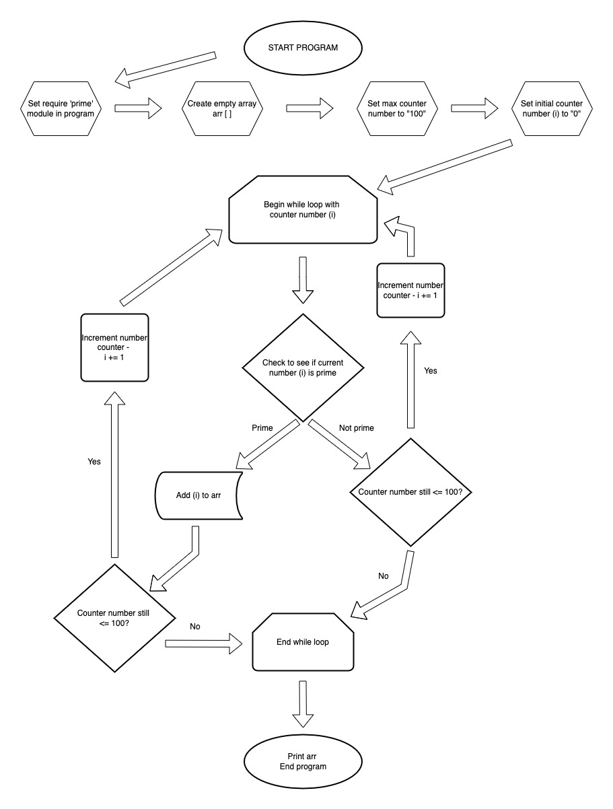

# Workbook T1A1
## Link to Assignment
Github: https://github.com/james-mcgregor100/JamesMcGregor_T1A1
&nbsp;  
&nbsp;  
&nbsp;  

# Questions - 
## **Question 1 - Identify and explain common and important components and concepts of web development markup languages**
Web development markup languages are different from computer programming languages. Web development markup languages are languages which arrange the elements on a page, and it decides how the page's elements should be formatted and structured. Markup languages are different from programming languages in that they do not use programming syntax - rather, they use standard human language. This question will be structured in two parts: the first part will list some common markup languages and important components of the specific languages; and the second part will identify the important concepts of markup languages *in general.*
&nbsp;  
&nbsp;  
## **Part One**  
### **HTML**
HTML stands for Hyper Text Markup Language, which is the language which which allows the user to view all webpages in a web browser. The role of HTML is to visually display data on a web page, which differentiates HTML from other markup languages, as will be explained in the paragraphs below. The HTML language provides web pages with meaning, and achieves this by assigning specific HTML elements to the content which is being displayed on the web browser. For example, when an ordered list of items needs to be displayed, the HTML will use a specific element called "ordered list" to assign it to the list of items. The HTML languages uses something called a "tag" which is what encapsulates or wraps the piece of text, and the tag is assigned a specific element depending on what element the web developer would like to implement. Another important feature of the HTML language is its way of assigning specific areas of the website (top, bottom, left, right, center) to specific elements. This helps to provide a general structure for how the page will be displayed, and provides meaning to the developer and the user. 
&nbsp;  
&nbsp;     
On all HTML pages, there are a number of specific HTML components which must be used to provide a basic structure to the website, before more specific elements are added. 


#### ***Source - https://developer.mozilla.org/en-US/docs/Learn/Getting_started_with_the_web/HTML_basics***
&nbsp;  
The snippet above shows the basic layout of a HTML webpage, with the most fundamental elements included. Firstly, the !DOCTYPE html tag tells the code editor that the document is a HTML document. The <html> tag is used to wrap the whole page in HTML language. The roll of the <head> tag is to have a title <title> tag which will display a page title on the tabs of a browser window. And the <meta> tag communicates to the code editor what language the code is being written in. 

Outside of the this are the <body> and <image> tags. The body element holds all of the information for the page inside of it, from the top to the bottom of the page. And the <image> obviously wraps around an image of a link so that it can be displayed in the HTML document. Aside from these elements there are a range of other fundamental components which can be found in most HTML pages when they are constructed, including: <h1>, <h2>, <h3> elements which indicate different sized headings, the <p> tag which indicates a paragraph of text, and the <br> tag which indicates a line break on the HTML page. 
&nbsp;  
&nbsp;  
One of the main components that can be found in HTML pages are "links", which are written as <a> in a HTML page. The HTML pages are able to display hyperlinks in the HTML file which allows users to navigate from one page to another. An example of a "link" component in HTML is presented below - 


&nbsp;  
&nbsp;
### **XML**
&nbsp;  
XML stands for Extensible Markup Language, and is one of the other main markup languages alongside HTML. One of the main differences between XML and HTML is that HTML is used to display data and text on the screen, whereas XML is used to store data as "structured information" (Loshin, Linthicum, Giza). Some important features of XML, which differentiate it from HTML, include: XML's tags are not predefined like HTML tags, and closing tags must be implemented throughout the document, whereas HTML is not as strict with the use of closing tags.   
&nbsp;  
&nbsp;
### **SGML** 
&nbsp;  
SGML (Standard Generalized Markup Language), and is known as the "standard for defining generelized markup language for documents (GeeksForGeeks 2021). HTML is said to have been developed from the SGML language. In other words, HTML is just one kind of a markup language according to the standards outlined in the SGML standards (Muellner and Walsh 1999). SGML code looks similar to HTML and XML, but its components have its own unique characteristics, and differs from HTML and XML. SGML code has the following components: 

#### ***Components of SGML***
&nbsp;    
&nbsp;   

**SGML Declaration**
The SGML document declaration is typically found at the beginning of a SGML document, but can also be found in a separate SGML file. The SGML is essentially a declaration which specificies the various default tags which will be used in the SGML document, what names will be attributed to them, the length of names and numbers, and which (if any) abbreviations are to be allowed in the document (Waslh and Muellner 1999, Page 16).
&nbsp;  
&nbsp;
**Document Type Definition**
Similar to a HTML document, a SGML document must state at the beginning of the document that it is indeed a SGML document. This is done by using the "DOCTYPE" tag, and a different keyword must be used in the doctype tag depending on what kind of file structure is being created, for example - a book, an article or a memorandum (Herwijnen, 1994, page 25-26 ). 
&nbsp;  
&nbsp;
**Document Instance** 
Finally, the document instance is actually the SGML file, with all of the code contained inside of it. The document will comprise of markup language, and of course, the contents of the document (Herwijnen, 1994, page 25-26). 
&nbsp;  
&nbsp;  
## **Part Two** 

The basic concepts found in the SGML/XML markup languages are: semantic markup, elements, attributes, and entities. 

Semantic markup is an important feature of markup languages, gives meaning to the content, and allows intepreting software to interpret the meaning of the content accurately. One example of this is the software which helps people with reading disabilities to interpret what is on a HTML page. Another main reason for including semantic markup in markup languages is to optimize a page for SEO purposes. Search engines are able to access the meaningful tags and elements used throughout the document in order to feed this information into the search engine's algorithms. Depending on the quality of semantic markup used in the document, the page may realise a higher or a lower ranking compared to other pages (Walsh and Muellner 1999, page 8). 

Elements and Attributes are the individual tags which are used throughout the pages created from markup languages. They are typically created with an openining and closing tag, however, in some instances, particularly with HTML, closing tags are not always required. Inside of an element, a class or ID name might be given in order to increase specificity to a particular element, or set of elements. Using IDs and classes can be beneficial for the developer when coding a markup language page as it helps to separate specific elements, and makes the code more readable (Walsh and Muellner 1999, page 9).

General entities are used in markup languages to specifiy special characters, and other pieces of text found in a document. Special characters such as the "copyright" symbol are able to be typed using the "&" symbol along with several characters, which allows the user who is coding the document to easily insert special characters into the document. Also, specific pieces of text which may need to be used many times over throughout a document may be  given something similar to a "variable" which will be written in place of the text, to allow for efficiency and simplicity in coding out the content of the page. Similar to a variable, an entity must be stated explicitly at the beginning of the document, so the document is aware that these entities will be used later on throughout the document (Walsh and Muellner 1999, page 10). 


van Herwijnen, E. (1994). Components of an SGML system. In: Practical SGML. Springer, Boston, MA. https://doi.org/10.1007/978-1-4615-2752-7_3  - Source for SGML, website - https://link.springer.com/chapter/10.1007/978-1-4615-2752-7_3?noAccess=true 
https://www.geeksforgeeks.org/sgml-full-form/ (2021)
https://www.google.com.au/books/edition/DocBook_The_Definitive_Guide/wQ3a1kBygkcC?hl=en&gbpv=0 - Walsh, Muellner (1999)
https://developer.mozilla.org/en-US/docs/Learn/Getting_started_with_the_web/HTML_basics 
Source - https://developer.mozilla.org/en-US/docs/Web/HTML 
Source - https://www.semrush.com/blog/markup-language/
Source - https://www.howtogeek.com/721685/what-is-a-markup-language/ 
Source - Loshin, Linthicum, Giza (https://whatis.techtarget.com/definition/XML-Extensible-Markup-Language)
&nbsp;
&nbsp; 
&nbsp;  
&nbsp;  

## **Question 2 - Define the features of the following technologies that are essential in terms of the development of the internet:**
&nbsp;
### **Introduction**
Since the development of the internet in the 1960s, there have been a number of components which have made up the internet that are still a core part of how the internet operates today.
&nbsp;   
&nbsp;  
### **IP addresses (IPv4 and IPv6)**
IP addresses, or Internet Protocols (both IPv4 and IPv6) are an address used by both devices. They are a personal identity and a unique address of a device, which allows each device to know where exactly they will be sending their data to across the internet.

Most people think of website domain names as being the primary address for a website in the ecosystem of the internet, however, the website domain name is used for reasons of simplicity and expediency. Behind every domain name for a website exists a unique IP address, which is considered to be the actual address for a website. 

The main difference between the IPv4 IP address and the IPv6 IP address is the amount of IP addresses that are able to be created on the network. It is believed that the IPv4 style of IP addresses will eventually run out of space to create new addresses, and this will lead to the adoption of the new, larger scale version of IP addresses, which is known as IPv6. For comparison, the IPv4 style of IP address has 32bits, where as IPv6 has 128bits (Lawrence Williams 2022). Due to the explosion of the human population, increasing technological adoption by the world’s population, and increasing number of computers, the IPv6 style of address will need to be used. It is believed that the IPv6 style will be able to hold a larger number of addresses than IPv4, which IT experts believe will be a sufficient amount for the foreseeable future (Josh Fruhlinger 2022).
&nbsp;  
&nbsp;
## **Explain how Packets have contributed to the development of the internet.**
If one thinks about this in terms of the development of the internet, the invention of Internet Protocols has allowed the world to become more interconnected technologically, and has allowed for communication barriers to be removed between people around the world. IP addresses in general have allowed information to be sent from its original sender to its destination. It has given unique identities for each device on the internet and allows a seamless way for data or information to be sent to one device to another without it being lost, or sent to the wrong device.
&nbsp;  
&nbsp;     
Laurence Williams - https://www.guru99.com/difference-ipv4-vs-ipv6.html 
### **Packets**
When one enquires into the information and data being sent to and from these IP addresses in the digital world, it will become apparent that this “data” or “information” is not just an abstract idea. A piece of data is a very real thing, and in order for this data to be able to travel through digital space and time through the internet, it must be broken down into something called “packets”. For the data to be sent more efficiently over the internet, it must be broken down into packets. This process of breaking data down into packets allows for more data to be sent over the internet simultaneously. By allowing multiple packet from the same piece of data to be sent over the network at the same time - a process called "packet switching" - data is able to flow freely over the network without being caught in a backlog (Cloudfare).

When the data is broken up in to multiple packets to be sent and received over the internet, the data is not simply broken up until a random series of data packets. Rather, the data packets are split up into a logical set of packets, which contain special information. Packets include a variety of components, with the main one being a packet "header". The header is given specific information pertaining to the packet's sender and receiver addresses (Gralla 1998, page 14-15). The information found in the header allows the packet to travel to its intended destination, and is also able to be sent back to the origin of the sender in case the data packet is corrupted and needs to be resent. Without the help of routers, the packets would struggle to travel in the right direction to their final destination. Routers play an important role in intercepting packets along the journey over the network, by interpreting their contents, and forwarding them on to the next router, and finally to help send it on to its final destination. 
&nbsp; 
&nbsp; 
## **Explain how Packets have contributed to the development of the internet.**
Packet switching (previously known as "message blocks) came out of the Cold War era, which was developed by people such as Paul Baran. The idea came from Paul's career at the RAND corporation and was initially implemented on local networks, however packet switching eventually became used on ARPANET, and of course, the internet as it is known today. The main idea behind packet switching was so switch from a centralized network, to a distributed network, where nodes (and later routers) were distributed throughout the network, with no centralized node running the network. Packets were also a part of this development and were designed to be able to travel along other nodes, if certain nodes were attacked and wiped out by the United States' enemys during the height of the Cold War (Paul Baran, 1964).

https://www.rand.org/pubs/research_memoranda/RM3420.html 
https://www.cloudflare.com/en-au/learning/network-layer/what-is-a-packet/ 
https://computer.howstuffworks.com/question525.htm 
&nbsp;   
&nbsp;  
### **Routers and Routing**
The words ‘router’ and ‘routing’ give us clues already as to what they are, and what their function is in relation to the internet. Routers play an integral part of the internet by acting as intermediaries between a sender and a receiver of information, and data. The routers are responsible for initially analyzing the contents of the packets once it arrives at the router, and once analyzed, they are then forwarded on to the next router on the route to its destination. In order for a packet of information to be sent from one computer to another, it must travel along digital pathways, and on these digital pathways there are a number of routers spread at different points throughout the network to receive and forward on data. However, the pathways that data travels from its sender to its receiver do not always occur in straight line from point A to point B, and sometimes data may need be ‘re-routed’ to a router which may branch off in a different direction, and eventually, it will be ‘rerouted’ onwards to its final destination. (Page 37, How the Internet Works by Preston Gralla, 1998)
&nbsp;  
&nbsp; 
## **Explain how Routers and Routing have contributed to the development of the internet.**
Routers and routing's main contribution to the development of the internet have been the role that they play in allowing packets of data to be able to travel between sender and receiver, through the routers. Since the internet has changed from a centralized network of nodes, to become a distributed network, routers play a crucial role in allowing data to flow all around the world. 

&nbsp;  
&nbsp;

### **Domains and DNS**
As mentioned above, IP addresses are the addresses which are the actual addresses of websites, and websites have been given domain names in order to help people remember easily how to find a particular website. Try to imagine for a moment if you were required to remember a random string of numbers instead of the phrase ‘www.facebook.com’. It would make remembering website names much more complex if we were to use IP addresses as opposed to domain names. 
An important component of DNS is ‘caching’. Caching is essentially a repository of data on your computer which stores information of previously visited websites. This data is kept on your computer for a fixed amount of time, and allows your computer to open up the cache files to find the details of a website that you are trying to connect to. If your computer does have this data stored in its cache, then it will be able to connect to a website quicker than if it had to find the details of the website externally, which would involve a process of anywhere between five to eight steps in order to successfully fulfill the user’s request. 
&nbsp;  
&nbsp;
## **Explain how Domains and DNS have contributed to the development of the internet.**
The domain and DNS have played a crucial role in the development of the internet since they they were invented in the 1980s. Due to the growing number of users on the internet, the number of IP addresses grew exponentially, and a solution was needed to store and identify. Initially, all devices connected to the internet were recorded on a .TXT file titled HOSTS.txt. Over time the 
.TXT file was unable to handle the large amount of records being kept in the file, and subsequently, technologists designed what we now call the Domain Name System to mitigate 
scalability issues (Shaw and Fruhlinger 2020). The domain name system was invented in the 1980s to deal with this issue of scaling IP addresses by storing all of the IP addresses and its computer host name in a structured list (Danielle Kehl 2015). This allowed the number of IP addresses to grow into the millions, and is the reason for allowing computers to connect to specific IP addresses without the user needing to remember each individual IP address when visiting websites. 
https://nap.nationalacademies.org/read/11258/chapter/4 
https://slate.com/technology/2015/05/icann-transition-the-interesting-history-of-the-internet-domain-name-system.html
&nbsp;
&nbsp;  
## **Question 3 - Define the features of the following technologies that are essential in terms of the development of the internet:**
&nbsp;  
### **TCP**
TCP stands as Transmission Control Protocol, which is a protocol which standardizes, or sets out the method for how data is sent and transmitted across the internet. The Transmission Control Protocol and Internet Protocol (IP) work together in tandem to facilitate the sending, receiving, and travel of data across the internet. The IP address sets out the addresses from the sender and the receiver devices, and the TCP decides how the data will get transmitted throughout the journey of a packet of data, from start to finish (Bodner 2021). A unique feature of the TCP/IP protocol is that it allows any device (regardless of its OS) to connect to the network, and also allows a range of different networks to connect together around the world by using the same protocol (Hunt 2010). 

https://www.google.com.au/books/edition/TCP_IP_Network_Administration/A_LL2LQASdoC?hl=en&gbpv=1&dq=tcp/ip+model&printsec=frontcover - Hunt 2010. 
&nbsp;    
&nbsp;
The TCP/IP architecture consists of four important layers. The layers are - the link layer, the internet layer, the transport layer, and the application layer. The layers are structured systematically, and determine how the data passes through each layer. A brief explanation will be given below regarding the role that each layer plays in the TCP/IP architecture: 

#### **Data Link/Network Access Layer/Physical Layer**
The Network Access Layer is the layer which is responsible for transferring data over the network. It allows two computers to be able to communicate with each other, and facilitates the sending and receiving of data. The data sent on this layer is usually between computers on a local network, or computers which are connected to the same network (Bodnar 2021).

https://www.avg.com/en/signal/what-is-tcp-ip#:~:text=There%20are%20four%20layers%20of,when%20the%20data%20is%20received. - (Bodnar 2021)
#### **Internet/Network Layer**
The Internet/Network Layer is primarily responsible for ensuring that packets are sent from the sender device, to the receiver device over a network. It also assumes the role of determining how the data packets are sent to the receiving device, and also makes sure the data packets are put back together before they are opened and read on the receiving end. By determining the routing method and which routers the packets will pass through, the internet/network layer efficiently takes care of the data packets while they are travelling from state to finish.  (Williams 2021).

https://www.guru99.com/tcp-ip-model.html - Williams (2021)

#### **Transport Layer**
The transport layer is responsible for providing the stable delivery of data packets from the sender to the receiver. If errors are not found in the packets being delivered, the transport layer process the next data packet to be sent over the network. If errors are found in the data packets for whatever reason, the transport layer will send a request for the data packet to be retransmitted again. The transport layer also acts as a signalling device which 

#### **Application Layer**
&nbsp;  
&nbsp;
### **Explain how TCP has contributed to the development of client and server communication over the internet (50 - 150 words for TCP)** 
The TCP has contributed immensely to the development of the internet by providing an architecture which would allow any kind of computer to communicate with another computer (Edwards 2021). This was a big breakthrough which allowed interoperability between different computers, regardless of what operating system each computer is running (Williams 2022).  TCP's main legacy is the fact it has achieved to provide an architecture to allow communication of data on the internet, from all over the world, to any device connected to the internet (Edwards 2021).

*Source - Edwards (2021) - https://developer.mozilla.org/en-US/docs/Web/HTTP/Basics_of_HTTP/Evolution_of_HTTP
*Source - https://www.ibm.com/docs/en/aix/7.1?topic=management-transmission-control-protocolinternet-protocol* 
&nbsp;  
&nbsp;  

### **HTTP and HTTPS**
HTTPS is different from HTTP in that it provides a layer of encryption, and thus is more secure than the HTTP protocol. If a similar form were to be submitted on both HTTP and HTTPS, someone attempting to hack the form would find it easier to access the information from the HTTP protocol, and would have trouble accessing the information via HTTPS. The encryption feature in HTTPS is an invaluable tool for websites, as it gives the company running the website an extra layer of trust and reputability.  
**Source** https://www.cloudflare.com/learning/ssl/why-use-https/ 
&nbsp;  
&nbsp;  

##### _Image Source - https://cheapsslsecurity.com/blog/http-vs-https-security-the-differences-between-these-protocols/_
&nbsp; 
From the diagram above, we can see that a HTTP website sends plaintext data over the internet to a website server, however, there is no data encryption taking place. These packets of data being sent over the internet are vulnerable to being exploited by hositle actors. HTTPS websites, on the other hand, encrypt their packets of data when they are sent from the website to the server. HTTPS websites are designed for protecting the user's sensitive data, such as their credit card details, passwords, and other sensitive personal information which should not be shared with third parties. The easiest way to determine whether a website is HTTP or HTTPS is whether or not a small padlock symbol is placed in front of the website's url. If the symbol is present, the website is secure - if there is no symbol, the website is not secure. 
&nbsp;
#### **TLS and SSL Encryption**
The main feature of a HTTPS website which facilitates the encryption process is called "Transport Layer Security", or TLS. Before the TLS protocol was implemented, the Security Socket Layer (SSL) was the main security protocol responsible for providing encryption of data sent over the internet. 

&nbsp;  
&nbsp;

This layer of trust is an important development of client and server communication. With the development of the internet, the number of  hackers has also grown, and therefore, the invention of HTTPS is a fundamental feature in the development of the internet over time. Since the early days of the internet, more and more websites have made the change from HTTP to HTTPS for obvious reasons, and the security protocols layers protecting the HTTPS websites have also gone through its own development.
&nbsp;
&nbsp;

### **Explain how HTTP/HTTPS has contributed to the development of client and server communication over the internet (50 - 150 words for HTTP/HTTPS)** 
HTTP from its inception was designed for the purpose of allowing document exchange, and document retrieval (MDN Contributers (Mozilla) 2022). This allowed for exchange over the internet, particularly data exchange, which was not possible before Tim Berners Lee came up with the idea of the Hyper Text Transfer Protocol. 

https://kinsta.com/knowledgebase/tls-vs-ssl/ 
https://aboutssl.org/ssl-guide/ 
https://cheapsslsecurity.com/blog/http-vs-https-security-the-differences-between-these-protocols/ 
https://www.globalsign.com/en/blog/ssl-vs-tls-difference 
https://www.cloudflare.com/en-gb/learning/ssl/why-use-https/ 
https://www.acunetix.com/blog/articles/tls-security-what-is-tls-ssl-part-1/ 
&nbsp;  
&nbsp;
### **Web Browsers (requests, rendering and developer tools)**
Web browsers have made many strides in their development since some of the first browsers were developed and used in 1994, such as Mosaic and Nexus. Today, some of the most popular web browsers used are Google Chrome, Internet Explorer, Mozilla Firefox, and Microsoft Edge. 
For a web browser to be able to display contents on the page, there are a series of steps that must take place before the user is able to see the fully loaded web page. There are a range of components which are needed in order for a web browser to work. A list of components which make up the web browser are as follows: 
&nbsp;  
&nbsp;  

##### _Image Source - https://www.html5rocks.com/en/tutorials/internals/howbrowserswork/#Resources_
&nbsp; 
&nbsp; 
### **User Interface**
&nbsp;
The user interface is responsible for displaying what the user can interact with when they open the web browser. The components of the user interface include elements such as toolbars, address bars, and home buttons.  It must be noted here that the user interface does not include the actual web page display. It only includes the components that are in the browser whether a web page loads or not. 
&nbsp;  
&nbsp;  
### **Browser Engine**
The browser engine is located behind the user interface and is considered to be a sort of intermediary which helps to connect the user interface with the rendering engine. 
&nbsp;  
&nbsp; 
### **Rendering Engine**
The rendering engine is responsible for displaying the elements and code which are written in HTML, XML, CSS, and Javascript. In order for the rendering engine to be able to translate the code into a visual display form on the web browser, the rendering engine must complete a  series of steps. The rendering engine is an important component of a web browser, and without it, the user would not be able to view anything upon opening a web page. Each browser uses a different kind of rendering engine, some of the major rendering engines, according to Neild (2020), are: 

- Webkit (used in Safari)
- Gecko (used in Firefox)
- Blink (used in Chrome)
&nbsp;  
&nbsp;

The rendering engine goes through several steps in order to complete the process of rendering, which can be seen in the diagram below: 
&nbsp;  
&nbsp;


#### *Image source - https://www.browserstack.com/guide/browser-rendering-engine*

From this diagram we can see that the rendering engine is completing a range of processes to make sure that the web browser is displaying the web page correctly. A basic overview of the steps required (seen in the diagram above) are outlined below: 
&nbsp;    
&nbsp;

1. The HTML must be parsed initially, which means that the HTML code must be interpreted and broken down into small chunks (or nodes) in order to create what is called a DOM tree. The CSS is also constructed into its own tree called the CSSOM.
2. Secondly, render tree is constructed, whereby the rendering engine determine what kind of order the DOM tree will be displayed in. 
4. Once the layout of the tree has been finalized, the rending engine moves onto the last step of painting the rener tree. This involves colorization of pixels, and converts the information in the render tree to actual visible pictures which are visible in the browser (Unadkat 2019)(Grigorik). 
&nbsp;    
&nbsp;  

The rendering engine does not pull the data and code from any random place, but it is constantly communicating with the networking component of the web browser in order to receive the information to begin rendering. 

**Unadkat (2019)**https://www.browserstack.com/guide/browser-rendering-engine 

**Grigorik** https://developers.google.com/web/fundamentals/performance/critical-rendering-path/render-tree-construction 


Neild (2020) https://www.gizmodo.com.au/2020/12/which-browser-engine-powers-your-web-browsingand-why-does-it-matter/ 
 

https://blog.sessionstack.com/how-javascript-works-the-rendering-engine-and-tips-to-optimize-its-performance-7b95553baeda Zlatkov (2018)
### **Networking**
The networking
layer plays a crucial part in delivering load speed and 
response times when loading web pages, or particular 
elements on web pages. The networking component is used for undertaking requests and calls to the network using protocols such as HTTP. Before making this request, however, web browsers will check to see if the local computer has a HTTP cache, which allows the page to load quicker. If a user has cleared their cache files previously, or if they have never visited a particular website, the networking layer will need to
&nbsp;  
&nbsp;
### **Javascript Interpreter** 
The Javascript intepreter is responsible for implementing the code written in Javascript to be displayed correctly in a web browser. Before the Javascript interpreter allows the Javascript code to be displayed, it must go through a process of evaluating the code to best decide how the 

**Source - Conrad (2018) https://softwareengineeringdaily.com/2018/10/03/javascript-and-the-inner-workings-of-your-browser/**
&nbsp;
&nbsp;
### **UI Backend**
The UI backend component plays the simple roll of displaying and drawing certain elements in the browser, such as check boxs, windows, and widgets. The operating system is what powers this process underneath the UI functions. 

&nbsp;
&nbsp;
### **Data Storage/Persistence**
The data storage component is responsible for storing various types of data related to the user's interactions with web pages through the browser. The browser is able to collect, track, and store the user's data, using different methods of data storage. Some types of data storage include:
&nbsp;  
&nbsp;
- Session storage
- Local storage
- Cookies
 
*source for local storage - https://developer.mozilla.org/en-US/docs/Web/API/Window/localStorage* 

*source for session storage - https://developer.mozilla.org/en-US/docs/Web/API/Window/sessionStorage*

&nbsp;  
The first type of data storage is session storage, where the data is stored in each tab in a browser. If a browser is closed, the data that was entered into or retrieved from the browser will be erased. Session storage thus only provides a temporary form of storage in the browser. Local Storage is similar to session storage, however its expiration date is much longer; it does not expire, even after the user has closed the browser or ended the session.
&nbsp;  
&nbsp;  
Cookies are also a form of storage used to enable faster load times. When  user visits a page, the history of their visit, and their activity on the website is stored in cookies. If the user is to return in the future to the same webpage, these cookies will allow the browser to remember the user, and thus will provide a streamlined experience. The storing of cookies can bring into question possible security risks or data breaches for the user, as they are having their every movement tracked in a web browser. However, over the years browsers and web pages have implemented a permission form that pop-up asking users if they wish to have their cookies stored or not. 

*source - https://www.kaspersky.com/resource-center/definitions/cookies*
&nbsp;  
&nbsp;
### **Developer Tools**
One important feature of web browsers that are used by many developers around the world are the developer tools. The developer tools function in modern day web browsers allows users to inspect the source code that makes up the webpage they are currently viewing. When developers are having problems with certain areas of their code, developer tools allows developers to inspect very specific areas of the web page in order to debug a problem if there is a problem with their code. Developer tools don’t only allow for inspecting code to spot errors or bugs, but they allow for users to change certain elements in the code in real time, and they output the code changes in real time in the browser for the developer to see. 


Steel 2021 https://au.pcmag.com/browsers/85834/30-years-of-browsers-a-quick-history 
About J Query - Web Browsershttps://books.google.com.au/books?id=mRdLDQAAQBAJ&dq=browsers+nexus+mosaic&source=gbs_navlinks_s 
Client and server communication over the internet through web browsers occurs when a client and a server are required to interact with each other. In the case of the web, clients are considered to be computers or devices, and servers are the servers in the backend of the web applications where data is stored. The client interacts with the browser by giving it a command or a request, and the browser subsequently relays that information (if necessary) to the server on the other end. The server then 
https://developer.mozilla.org/en-US/docs/Learn/Getting_started_with_the_web/How_the_Web_works 


Explain how each technology has contributed to the development of client and server communication over the internet (50 - 150 words for each technology)
Client-Server Model - an overview | ScienceDirect Topics
https://www.browserstack.com/guide/browser-rendering-engine - Browser Source - Unadkat (2019)
https://plg.uwaterloo.ca/~migod/papers/2006/jsme-browserRefArch.pdf - A reference Architecture for Web Browsers - Alan Grosskurth
&nbsp;  
&nbsp;  
### **Explain how the Web Browser has contributed to the development of client and server communication over the internet (50 - 150 words for Web Browser)** 
The contribution to client and server communication that web browers is a significant one. The web browser has been responsible for allowing the client to interact with the server by making requests to pull images and data from the server, and the web browser is then responsible for displaying those images and data once the request has been fulfilled (Ionos). One of the specific contributions was the development of the Mosaic browser in the 1990s, which allowed for images, video clips, and graphics to be displayed on the client side instead of the previous browers which only displayed plain text websites (Hart 2004). 


https://www.nsf.gov/discoveries/disc_summ.jsp?cntn_id=100274&org=NSF 
https://www.ionos.com/digitalguide/websites/web-development/server-side-and-client-side-scripting-the-differences/ 
&nbsp;  
&nbsp;
## **Q4 Identify THREE data structures used in the Ruby programming language and explain the reasons for using each.**
Data structures in programming languages contain collections of data, big or small, and have a number of use cases. Primarily, the data structures that hold groups of data are there for someone to access the data, retrieve a piece of data, delete a piece of data, or insert a piece of data. In programming, there are more than one way to store and collate data, and these different methods of structuring and storing data are called “data structures”. Three commonly known data structures in the Ruby programming language are: arrays, hashes, and binary trees. 
&nbsp;  
&nbsp;  
### **Arrays**
&nbsp;
#### **Identify**
Arrays are a data structure which holds a list of variables in an index. An important note to make about arrays is that they are not the same as arrays in other programming languages. Arrays in other programming languages are considered to be static, while arrays in Ruby are considered to be dynamic. This means that static arrays in other programming languages must input the specific size of the array when it is first being added, and its size cannot be modified once it has been created. However, in Ruby’s case, a dynamic array is able to be modified and changed, long after the array has been created. 
A basic array data structure may look something like this:
&nbsp;    
&nbsp; 
Countries = [Australia, Japan, China, Germany] 
&nbsp;   
&nbsp;
&nbsp;  
The elements within an array are ordered in an index, and they are automatically ordered starting from 0 (zero). This allows for data retrieval of particular elements within the array simply by calling upon the index number in the index. In the above example the index would look like this - 
&nbsp;  
&nbsp;  
[0, 1, 2, 3,] 

0 = Australia, 1 = Japan, 2 = China, 3 = Germany
&nbsp;  
&nbsp;  
#### **Reasons for using an Array**
Arrays are an important data structure to use in programming as they allow the program to hold blocks of important data, which contain many elements. Storing many elements in one index allows the program to access, retrieve or store large amounts of data, and to locate specific pieces of data accurately and easily. Arrays store data in an index in numerical order, starting from the number zero (0). Therefore, it is easy for a piece of data to be located in the array as it has its own unique location among the other data in the array. This can be very convenient when needing to retrieve specific data objects from an array.

Arrays are a particularly great data structure to use to store a group of data that are related to each other. For example, if a program were created about selling animals online, an array may be used to store the data of all dog breeds, or all cat breeds that are bought and sold on the website or application. Moreover, arrays only use one variable to give a value to the array, as opposed to a list of individual variables, and this uses less memory in the program and allows for faster search times.

Although there are several reasons for opting to use an array to store and retrieve data, a Hash could also be a good option, depending on the use cases and the requirements of the company needing access to the data. 


Source for Arrays - https://w3.cs.jmu.edu/spragunr/CS240_F12/ConciseNotes.pdf - page 10-page 11 
Source for Arrays - https://www.google.com.au/books/edition/Learning_Ruby/pYS_Fm5LqUYC?hl=en&gbpv=1&dq=introduction+to+ruby&printsec=frontcover page 93 
Source for Arrays - https://www.google.com.au/books/edition/Ruby_Programming_for_Beginners/3lWSzQEACAAJ?hl=en - page 142 


### **Hashes**
Hashes are similar to arrays, in that they store a group of data. There are two main diffences between hashes and array. Firstly, the elements within an array do not need to be assigned a value or key. Secondly, the hashes are in an unordered index, unlike arrays. For a hash to be correctly written in code, the elements within the hash must be assigned both a value and a key. The keys and values within the hashes are called upon when writing the code to retrieve a piece of data from within the hash. Acording to Castello (2020) some basic use cases for hashes include: listening vocabulary in languages which provide a varieyty of definitions. Each definition would be a new value/key pair. Also, lists of people's names, or usernames. 
Here is a basic example of what a basic hash data structure may look like: 
&nbsp;  
&nbsp;

Days = {"Monday" => 1, "Tuesday" => 2, "Wednesday" => 3, "Thursday" => 4}
&nbsp;  
&nbsp;
In the above example, the word "Day" is the name of the hash, the word "Monday" is the key of the hash, and the number '1' is the value associated with the key word "Monday".
&nbsp;  
&nbsp;
#### **Reasons for using a Hash**
Similar to arrays, hashes also use an index to allow retrieval of individual data items, except the index for an array is different to the index hash's index. In a hash, the index is the "value" (refer to above), as opposed to the strictly set out index numbers that are set out automatically by the programming language.

A reason for opting to use a hash instead of an array might be because of the programmer's choice to set whatever string or integer of their choice to the hash's values. This gives the programmer more freedom in deciding how the hash will be indexed, and how it's "values" will be labeled. For specific circumstances, a programmer might feel this is a better option when building out a data structure for their program. 


*Source for hashes - https://www.google.com.au/books/edition/Learning_Ruby/pYS_Fm5LqUYC?hl=en&gbpv=1&dq=introduction+to+ruby&printsec=frontcover - Chapter 7, page 107*

*Source for hashes -https://books.google.com.au/books/about/Ruby_Programming_for_Beginners.html?id=3lWSzQEACAAJ&redir_esc=y* page 158 

*Castello (2020) - https://www.rubyguides.com/2020/05/ruby-hash-methods/* 

### **Trees**
&nbsp;
&nbsp;  
Trees are another common data structure in the Ruby programming language, and they play a similar role as an array and hash data structure. However, trees are different from arrays and hashes by the way that they store and structure the stored data in a non-linear way. A tree data structure is a top down structure, unlike the arrays and hashes which are left to right. The tree is structured with a root at the very top, and with nodes branching off the root below to the left, and to the right. The nodes which branch off the branches above are called children, as they are descendents of the branches above. Because the tree is structured literally like the structure of a tree in the real world, the term used for searching the tree is "tree traversal", which is different from searching a linear index like a hash or an array. 
&nbsp;  
&nbsp;  
#### **Reasons for using a Tree**
A reason for using a tree over a linear data structure such as a hash or an array is because the tree traversal takes a short amount of time to insert and delete data. On the other hand, trees may become lopsided (on the left or the right side) and this could lead to problems with the data structure. Another reason a programmer may opt to us a tree over other data structure types is due to the hierarchical nature of a tree. If a particular data set requires the the data to be structured in a hierarchical manner, the tree might be the perfect option for this use case (Indeed 2021). Indeed, it is important to weigh the pros and cons of using a tree, and to determine if your data set requires a more linear approach like a hash and array, or a hierarchical structure like a tree.


https://in.indeed.com/career-advice/finding-a-job/what-is-tree-data-structure 
*Source https://www.programiz.com/dsa/trees*
Source for Trees - https://w3.cs.jmu.edu/spragunr/CS240_F12/ConciseNotes.pdf - page 93
http://www.cs.uni.edu/~wallingf/teaching/agile-may2010/ruby/programming-ruby.pdf (page 14 for hashes and arrays)
https://www.rubyguides.com/2019/04/ruby-data-structures/ 
https://www.google.com.au/books/edition/Computer_Science_Programming_Basics_in_R/T84ocHBqvEUC?hl=en&gbpv=0 
## **Question 5 -  Describe the features of interpreters and compilers and how they are different.**
Computer programs are written using high-level language, meaning its language is similar to that of human languages; more specifically, the English language (among others). The problem with computer programs being written in high-level language is that computers are not able to understand this type of language. Therefore, computers require programs such as *interpreters* and *compilers* to convert the high-level language code into low-level language code, otherwise known as "machine language". According to Interviewbit (Interviewbit 2022), interpreters and compilers share similar features, with some
exceptions. 
&nbsp;  
&nbsp;
### **Features of Compilers and Interpreters**
&nbsp;  
&nbsp;  
#### **Compiler**
The compiler is a program which translates source code into machine code. It goes through single cycle, starting from the reading of the source code, the assembling of the source code, and then the output into machine language. The compiler must go through one full cycle of this before it can produce any feedback on any errors that were found during the compiling process. Once the errors are communicated at the end of the compiling process, they must be resolved by the compiler can perform its next compile cycle, and before it finally produces the machine language. The compiler typically runs through each cycle quickly, as it does not need to stop to check for errors whenever they are discovered. Another feature of the the compiler is that it must go through the entire process of compiling the language before the program can be run. It cannot run the program line by line as it is compiling the language. If any errors are discovered, only after the adjustments are made, and the compiling process has been completed a second time will the compiler be able to produce the new output. Depending on what the requirements are for the programmer, the execution speed could be fast, because it does not stop at every line - however, it could also be slow for debugging and testing purposes as the errors cannot be found and fixed line by line (John Smith 2022).
&nbsp;  
&nbsp;
https://www.guru99.com/difference-compiler-vs-interpreter.html 
#### **Interpreter**
The Interpreter is also a program which translates the source code into machine code. However, the method which the interpreter uses is different from the compiler's method. One of the interpreter's main feature lies in the way it executes the process from intepreting source code to outputting machine code. The interpreter carefully goes through the source code in a line by line fashion, and provides information every time an error is found on a line of code. The interpreter does this line by line until it reaches the end of the code, and finally outputs the code into machine code. Because the interpreter uses a line by line method to interpret the code, it allows the source code to be adjusted during the intepretation process. Depending on the programmer's objectives, the line by line method that the interpreter uses could be very beneficial in helping the programmer find and fix any bugging issues as they arise. Because of the unique characteristics of the interpreter, it may be suitable for developing websites, where fast load times are necessary. The instant feedback from the interpreter can be a huge benefit to programmers needing to make quick changes to their program (John Smith 2022).
&nbsp;  
&nbsp; 
*Source https://www.guru99.com/compiler-design-phases-of-compiler.html* - John Smith 

### **Differences betwen Interpreters and Compilers**
&nbsp;
&nbsp;
#### **Method Used**
The primary difference between interpreters and compilers is the method that each use to convert the program into code. In the case of the compiler, the program is analyzed, and the whole program is converted in code in one setting. This is distinctly different to the interpreter which analyzes small chunks of the program, and converts them into code, one by one. Because the interpreter is constantly analyzing the program line by line, it is providing feedback of any errors that may occur every step of the way (Tripathi 2021). However, because the compiler analyzes and converts the program into code from start to finish in one setting, any errors that are present in the lines of code will not show up until the compiler has finished the conversion (Tripathi 2021).  
&nbsp;
&nbsp;
#### **Execution Speed**
Since the interpreter and compiler both use different methods to convert the source code into machine code, the duration of the conversion varies markedly between the two. Interpreters are able to translate source code quickly, however, because the interpreter stops at each line, the overall conversion time is long. The compiler, on the other hand, is slower to initially translate the source code, but overall duration time is faster, because it does not stop to scan errors line by line like the interpreter (Programiz).
&nbsp;  
&nbsp;
#### **Compatible Programming Languages** 
Finally, the other distinct difference between the interpreter and the compiler is the issue of compatibility of languages. Not all languages are compatible with the interpreter and the compiler. The interpreter is compatible with programming languages such as: Python, Ruby, Javascript and MATLAB. And the compiler is compatible with programming languages such as: C, C++, and C#. 
&nbsp;  
&nbsp; 

Source - https://www.freecodecamp.org/news/compiled-versus-interpreted-languages/
https://www.businessinsider.in/difference-between-compiler-and-interpreter/articleshow/69523408.cms#:~:text=Interpreter%20translates%20just%20one%20statement,the%20process%20is%20much%20slower 

Source - https://www.programiz.com/article/difference-compiler-interpreter 

https://www.geeksforgeeks.org/difference-between-compiler-and-interpreter/ 

Source - https://www.interviewbit.com/blog/difference-between-compiler-and-interpreter/


## **Question 6 - Identify TWO commonly used programming languages and explain the benefits and drawbacks of each.**
&nbsp;  
## **Identify two commonly used programming languages**
&nbsp;
- Javascript
- Python
&nbsp;     
&nbsp;  

Two commonly used programming languages are Python and Javascript. Both Python and Javascript are two of the most popular programming languages in the world right now, and they both have their own unique drawbacks and benefits. 
&nbsp;  
&nbsp;  

## **Explain the benefits and drawbacks of each**
&nbsp;
&nbsp;

## **Javascript**
### **Benefits**

Javascript is known for being programming language which can be used effectively both on the front-end and on the back-end. Its versatility of use cases means that people can essentially use Javascript by itself, without having to rely on another language for the front-end of the web application, or vice versa with the back-end. This is a major benefit of choosing to program using Javascript. Although Javascript is used on the back-end in development, the main reason for its popularity is its effectiveness on the front-end, and developers are able to build beautiful, dynamic, and responsive websites (Mukherjee 2020).
&nbsp;  
&nbsp;  
Javascript is known for its speed compared to other languages such as python. This is because it uses client side script, which means that the Javascript code is actually in the client’s browser, and thus allows the developer to create an entire website with just a single programming language (Lasn 2019). This highlights how flexible Javascript is for a programming language, and it provides beginner programmers a pathway into both front end and back end development without having to learn other languages. 

Another benefit of using Javascript is the amount of libraries and frameworks which can be used when building websites and
applications. Javascript has a range of frameworks which allow developers to implement while developing front end and back end programs. Front end libraries such as Angular, React and Vue are all related to Javascript, and these allow the developer to streamline the process of writing code (Pandit 2021). 


https://www.c-sharpcorner.com/article/what-and-why-reactjs/#:~:text=js%3F-,React.,to%20create%20reusable%20UI%20components. 
https://betterprogramming.pub/what-makes-javascript-javascript-b9ab51ad983a 
https://opensource.com/article/20/11/javascript-popular - Mukherjee
https://www.tutorialspoint.com/javascript/javascript_overview.htm 
https://data-flair.training/blogs/advantages-disadvantages-javascript/ 
&nbsp;
&nbsp;

https://itechnolabs.ca/millions-of-developers-use-javascript-for-frontend/ 
### **Drawbacks**
Although Javascript is one of the most popular programming languages in the world, it is still a language that has flaws - particularly when it comes to security. One of the major cons of Javascript is that Javascript code on the front end is written in the browser, and this can leave the client-side open to security threats from hackers or hostile actors. If the programmer who designed the front-end of a website or application with Javascript neglected to implement specific security precautions, there is the potential for malicious code to be injected into the web browser. This could result in user's passwords or sensitive information being stolen from a website, or even more seriously, a computer may be taken over by a hacker (Agarwal 2017).

Another drawback when using Javascript the problem of interoperability between different browsers. Javascript is known for producing different results on the web browser, depending on which version browser the website is being viewed on. Although this is a drawback of Javascript, there are ways to solve this issue, such as implementing a jQuery into the code (Mozilla 2022).
&nbsp;  
&nbsp;  
https://developer.mozilla.org/en-US/docs/Learn/Tools_and_testing/Cross_browser_testing/JavaScript - (Mozilla 2022)
https://www.algoworks.com/blog/security-concerns-with-javascript-development/ 
https://weeklyhow.com/pros-and-cons-of-javascript/ - Polidario 2020 
## **Python**
### **Benefits**

One of the main benefits of using Python is its popularity among tech communities, because it is open source and free for everyone to use. Surveys suggest that Python is one of the most popular programming languages in the world. It is a versatile language which can be used for a variety of purposes, including: web development, machine learning, data analysis. However, it really excels with machine learning, data analysis and artificial intelligence. Kumar (2021) explains that Python is one of the better languages to use for AI and machine learning because of its access to a wide array of libraries and communities of developers. They facilitate an increase in the language being widely used, and the knowledge base grows as a result. Unlike some other languages, it is also available on a range of operating systems, and as such, developers who are using specific operating systems are not excluded from programming with Python. Python is considered to be a high-level language, meaning its syntax is close to the syntax of human languages, and is considered an easy programming language to learn (Kumar 2021). This allows more people to get involved in the community, and the amount of people contributing to the development of AI and machine learning algorithms in the Python libraries expand as a result. 


### **Drawbacks**
One of Python’s main drawbacks is that it is considered by many in the tech industry to be a “slow” language. It must pass through a process of interpretation between writing the code and implementing the code. According to Hull (2021) a dynamically typed language such as Python needs to have its code interpreted by an interpreter before transforming into executed code. Other static languages do not have this issue as their variables are 
https://towardsdatascience.com/why-is-python-so-slow-and-how-to-speed-it-up-485b5a84154e 
https://www.geeksforgeeks.org/what-makes-python-a-slow-language/#:~:text=Internally%20Python%20code%20is%20interpreted,PVM%20(Python%20Virtual%20Machine). 
Further research regarding the slow processing speed of Python suggests that the main cause of Python’s slow speed as a dynamically typed language (compared to other dynamically typed languages) is because of its Global Interpreter Lock (GIL). According to McCurdy (McCurdy) Python has issues with processing speeds when it is undertaking multi-threaded processes, processing multiple threads simultaneously (McCurdy). However, although Python does have issues relating to processing speeds of multi-threads, people such as McCurdy have figured out ways to get around these issues, such as multiprocessing.
https://www.infoworld.com/article/3637073/python-stands-to-lose-its-gil-and-gain-a-lot-of-speed.html 
Although Python and Javascript both have their own unique drawbacks, they are both very powerful languages, and are also able to compliment each other. As Berga and Ferreira (2021) noted, Python is used on the back-end of Instagram, and Javascript is used on the front-end. This is a perfect example of both languages being used in one of the most popular applications in the world while complimenting each other. 
Source - https://www.imaginarycloud.com/blog/python-vs-javascript/ - 2021
Source (Kumar 2021) - https://www.rtinsights.com/why-python-is-best-for-ai-ml-and-deep-learning/#:~:text=The%20benefits%20of%20making%20Python,the%20popularity%20of%20the%20language. 
Source - -https://www.toptal.com/python/beginners-guide-to-concurrency-and-parallelism-in-python)  - McCurdy 
## **Q7 Identify TWO ethical issues from the areas below and discuss the extent to which an IT professional is ethically responsible in terms of the issue.**
&nbsp;
&nbsp;
## **Ethical Issue 1**

  ### ***Identify Issue*** 
  - Data Privacy - Access to a user’s personal information (medical, family, financial, personal attributes such as sexuality, religion, or beliefs)
&nbsp;  
&nbsp; 
### ***Discuss the extent to which an IT professional is ethically responsible in terms of the issue***
According to the Australian Computer Society's Code of Conduct, and Code of Ethics (Australian Computer Society 2014), the IT professional has a number of ethical responsibilities to uphold when collecting and working with citizen's private data. Central to the ACS's Code is the value of placing the interests of society at large, and the public good, above all else, including personal, or business interests. 

Within this primary value, the ACS's Code outlines a range of specific values and actions that an IT professional must uphold. In 1.2.1 subheading J of the Code, the ACS explains that the IT professional must "endeavour to preserve the confidentiality and privacy of the information of others" (ACS Code of Conduct 2014). This is a clear indication that the IT professional is ethically responsible to protect the privacy of customer's data and sensitive information to the best of their ability and knowledge. 

The developer is responsible for implementing software programs which are collecting, analyzing and distributing customer's private data in accordance with the ACS's Code. The issue with the ethical responsibility of keeping sensitive data private lies in the fact that not all actions deemed unethical are illegal according to certain laws in Australia. Therefore, a IT professional may unintentionally carry out their job role in an unethical manner without realising it; the company they are working for may be based on a business model that demands them to harvest and distribute private data. Also, unlike the Bar Association for lawyers in countries like Australia, there is no formal organisation where a technology professional must apply for and hold a licence while working as an IT professional (Merkel 2015). This can have consequences for the industry, whereby IT professionals may be engaging in behaviour that is considered by some to be unethical, however it is not considered to be illegal illegal. Merkel (2015) argues that while the Code of Ethics promoted by the Australian Computer Society is generally a positive way to uphold and promote ethical behaviour in the tech industry, it is little more than a performative act. Codes like the ACS Code of Conduct hold no weight when it comes to the legality of an issue, and only serve as a guideline for IT professionals.  Merkel (2015) explains that, ultimately, the companies who are hiring their IT employees are making the business decisions, and the IT professional is paid to do their job - they are not paid to force the management team to change the business model or business practices due to ethical issues.
&nbsp;  
&nbsp; 
 ### ***Identify a source of legal information relating to the ethical issue and discuss whether the law is helpful in assisting a developer to act in an ethical way. (Word count guide: 200 words max)***
&nbsp;  
&nbsp;  
The Federal Privacy Act 1988 (Commonwealth) of Australia is the primary source of legal information relating to the issues surrounding data privacy and data breaches. The Act (1988) states that businesses (and its employees) are required to protect their customer’s information from a range of threats, including: theft, unauthorised access, misuse, modification and disclosure (Australian Government 2021). The Act (1988) also includes a framework titled the “13 Australian Privacy Principles” which determine the way a business must operate when dealing with the privacy of their customer’s data. The Privacy Act (1988) and the frameworks within the Act are helpful in assisting a developer to act in an ethical way when dealing with the company’s software, and its customer’s private data. The Act is robust, and provides a wealth of information, including supporting hotlines and government departments who can be contacted if the employee needs any assistance or clarification. The frameworks are very easy to understand, and follow, however, the Privacy Act (1988) unfortunately cannot stop a rogue IT professional from illegally accessing data, or illegally leaking the data. Rogue employees do not follow ethical principles and act outside of the law.
&nbsp;  
&nbsp; 
## **Ethical Issue 2**
 ### ***Identify Issue*** 
 - Criminal acts such as theft, fraud, trafficking and distribution of prohibited substances, and terrorism
&nbsp;
&nbsp;
### ***Discuss the extent to which an IT professional is ethically responsible in terms of the issue*** 
According to the Australian Computer Society's Code of Conduct, and Code of Ethics, and also the Association for Computing Machinery's (ACM) Code of Ethics, the IT professional is obligated to not partake in any actions in their job that will negatively affect the public, cause harm to the public, or cause harm to the environment. Both codes urge the IT professional to uphold their values of protecting the great public good, and to be honest and to perform their job role with integrity. If the IT professional discovers unethical behaviour taking place while doing the job, they are fully responsible for reporting the matter, and should be prepared to face the consequences for covering up illegal and unethical activities (ACS Code of Conduct 2014, and ACM Code of Conduct 2018).  

&nbsp;    
&nbsp;  
### ***Identify a source of legal information relating to the ethical issue and discuss whether the law is helpful in assisting a developer to act in an ethical way. (Word count guide: 200 words max)*** 
The Australian Consumer Law (2010) (ACL) is a federal law in Australia which aims to protect the Australian public from businesses engaging in misleading product marketing, product safety, unfair market practices, and a range of other activities (Australian Government 2021). The ACL (2010) would be the most appropriate law for assisting IT professionals in Australia to act in an ethical way while perform their duties as an IT professional. The Australian government has passed this law in Australia to ensure that businesses have a set of guidelines explaining what is considered fair and unfair trading practices in Australian business. The problem with a law such as the ACL (2010) is that many businesses often engage in unethical behaviour when selling or promoting their products to the market, and sometimes the issue goes under the radar. 

If a software developer is committed to working in an ethical manner, they must refer to, and follow the the information set out in the Act whenever they may be unsure, or worried about whether they are acting unethically, or worse, committing a crime. The Act is helpful for developers to understand what they can and cannot do while contributing to the design process of a software program. If the developer feels that they may be creating software that may be falsely promoted or marketed to the public, the Act stipulates what is considered a violation of the Act.
&nbsp;  
&nbsp;  

### ***Conduct research into a case study of ONE of the ethical issues you have chosen. Discuss how an ethical IT professional should respond to the case study and how they might mitigate or prevent ethical breaches. (Word count guide: 400 - 600 words)***
&nbsp;  
### ***Case Study - VW Emissions Scandal*** 
&nbsp;  
I have chosen to research the case study about the Volkswagen fraud scandal committed in Europe. The Volkswagen fraud scandal was uncovered in 2014, and they were found to have installed a secret piece of computer software in a specific model of their car to mislead the authorities about the car's emissions output. The computer software was used to change the emissions output when it was being tested by the authorities, and once testing was finished, the cars produced a much higher output. VW faced a major backlash, and faced criminal charges for evasion of U.S emissions standards, and were fined $2.8billion. This case study is a perfect example to discuss about ethical issues for IT professionals, as the scandal revolves around secret software being sold to Volkswagen, and also secret software being implemented by Volkswagen. 
&nbsp;
&nbsp; 
### **Discuss how an ethical IT professional should respond**

It is clear that the actions by the staff at Volkswagen were unethical, and also illegal, but it is also difficult to discuss how an ethical IT professional should have approached the situation at Volkswagen while the scandal was occurring. It is difficult precisely because there is evidence to suggest, such as the article penned by Santos (2016), that Volkswagon's autocratic leadership style was one of the primary reasons the scandal took place. The head of Volkswagen (during the period of the scandal) was an "autocratic leader" who would never take no for an answer, and engineers had been known to be terminated from the company if they did not follow orders. This leadership style seeped down into the corporate culture of the company, regardless of what was written in the company's Code of Conduct about upholding values and ethics in the workplace (Santos 2016).
&nbsp;  
&nbsp;  
If the case study is to be approached by using the highest of ethical standards as a framework on how to act in such a situation - regardless of the company's culture - then the IT professional involved could have taken ethical action in a variety of ways. If the IT professional had discovered illegal activity within the organisation, regardless of how much pressure they were under to complete their job, they should have blown the whistle and contacted the relevant authorities. The Association for Computing Machinery (ACM) are self proclaimed as the "world's largest educational and scientific computing society", and they have their own code of ethics (ACM Code of Ethics and Professional Conduct) which stipulates how a software engineer should have acted in a situation similar to the VW scandal. The ACM's Code clearly states in its preamble that the IT professional must act to uphold, and serve the public good at all times. In the body of the Code, there are several important sections which act as guiding posts an IT professional. By using these points as a guideline in the case of the VW emissions scandal, the IT professional *should* have taken the appropriate steps to check the guidelines, and act according to the advice layed out in the Code (ACM 2018). 

Firstly, the Code states in Section 1.1 that an IT professional must strive to minimize the effects negative effcts that computing (and in this case computing software) has on people's health, and it should minimize the negative effects on the environment. The IT professionals at VW would have known from the very first section of the ACM's Code that they were acting unethically, and should have began to raise their concerns with confidential sources in the media, or to government authorities(ACM 2018). 

In Section 1.2 of the Code, IT professionals are instructed to "minimize harm" to others, and to the environment. In this section, it is strictly advised that if the management team of the company are unwilling to fix the issue occuring, the IT professional is obliged (ethically) to "blow the whistle" to make sure that do everything possible to stop the harm from occuring. Again, this is a clear piece of advice from the ACM which states the responsibilities of an IT professional, regardless of what the company's culture or management team are like. They *should* have blown the whistle, and they had a chance to blow the whistle in the early stages of the scandal, when they knew the piece of software to deceive emissions tests would harm both the world's environment, and possibly also the health of the world's population (ACM 2018). 

Section 2.2 of the Code states that an IT professional must abide by all laws, from local laws in their home country, to international laws. Unless the IT professional is able to justify not abiding by these laws, for ethical or moral reasons, the law must be followed, regardless of what the company's culture is like, and regardless of what their manager asks them to do. In the case of the VW scandal, the IT professionals (especially software engineers in positions of seniority) should have consulted with the national and international laws when they realised they were developing and implementing the software (ACM 2018). 

The IT professionals in the VW scandal should have also followed Section 3.1 of the Code, which states that the public good is the most important principle that they must abide by. The software engineering team who installed the secret software in the VW vehilces knew that they were committing a crime, and that the crime was contradictory to the public good. Therefore, the IT professionals should have abided by 3.1 of the Code, and taken action against their employer, or refused to install the software (ACM 2018).

It is clear that all of the IT professionals involved in the scandal should have at least refused to work on developing and installing the illegal software into the VW vehicles, and ultimately, they should have blown the whistle on the illegal operation. The ACM's Code of Conduct and Ethics (2018) is extremely clear in its explanation of how IT professionals should conduct themselves while working in the profession, and it the IT professionals in this instance failed to uphold and undertake the duties as per the obligations written in the Code. IT professionals must learn from this catastrophic mistake in the case of the VW scandal, and must be urged by the tech community, and the general public, to adhere to these obligations moving forward. This will ultimately reduce the number of fraudulent and criminal acts being committed by professionals in the information technology industry.


https://business.gov.au/products-and-services/fair-trading/fair-trading-laws#:~:text=The%20Competition%20and%20Consumer%20Act%202010%20(the%20Act)%20is%20a,that%20consumers%20are%20treated%20fairly. (Australian government 2021)

https://www.acm.org/code-of-ethics (2018)

Source (Santos 2016) - https://ideas.darden.virginia.edu vw-emissions-and-the-3-factors-that-drive-ethical-breakdown 

https://europe.autonews.com/automakers/german-engineering-firm-iav-pleads-guilty-vw-emissions-scandal 

Robert Merkel and Oliver Burmeister (2015)https://theconversation.com/a-code-of-ethics-in-it-just-lip-service-or-something-with-bite-32807 
5 Ethical Issues in Technology to Watch for in 2021 | CompTIA 
Ethical Issues in Information Technology (IT) – GeeksforGeeks 
https://www.natlawreview.com/article/australia-s-online-privacy-bill-and-privacy-act-discussion-paper-first-steps-towards 
 

## **Q8 Explain control flow, using examples from the Ruby programming language**
According to Mozilla, control is the order in which statements, or lines of code are executed in a program (Mozilla, MDN Contributers). Depending on which language you are using, there will be statements which are specific to that language, which have the ability to alter the control flow in a unique way. Some examples of different control flow statements that are found in the Ruby programming language, are - 'if' statements, 'if/else' statements, 'unless' statements, 'while' statements. These particular statements can be found in a control structure called a "loop" in Ruby (Bodnar 2007). Two examples will be provided below to demonstrate control flow, and control flow statements. 
&nbsp;
&nbsp;

1. If/else statement
```ruby 
puts "Before you enter, you must show your ID card to prove you are over 18."
age = gets.chomp.to_i

if > 18 
    puts "Feel free to enter the bar"
else 
    puts "You are under the age of 18, you cannot enter"
end 
```
This code snippet shows a basic if/else statement in the Ruby language. The control flow begins with a string asking a question, and then a gets.chomp statement to ask for the user to input their age. Once this has been completed, the program moves on to the if statement where the flow begins to be altered, depending on two conditions. Firstly, if the user has inputted that they are over the age of 18, they can enter, and the program will finish running. This means that if the first condition is met, the program will finish running. Secondly, if the user is not over 18, the program will move to the "else" statement, and print out that the user is not allowed to enter the premises. If the first condition is not met, the second condition will become true and will be executed. Once the else statement has been executed, the control flow will move to the end of the program and the program will finish running. 
&nbsp;  
&nbsp;  

2. While statement
```ruby 
num = 0

while num <= 50
    puts "The current number is #{num}. This program will keep running until the number hits 50"
    num += 1
end  
```
This code snippet shows a basic while loop in the Ruby language. The control flow begins with the variable "num" being set to "0". The while loop begins with setting out a condition. While the current number is smaller than or equal to 50, it must print out a string. Once the string has been printed, the current number (num) will then increment by 1, and if the number is still less than or equal to 50, the while loop will run again, this time using number "1". The loop keeps executing this code until the "num" is less than or equal to 50. Once the "num" reaches 50, the "end" command will stop the flow of the code. 
&nbsp;
&nbsp; 
https://zetcode.com/lang/rubytutorial/flowcontrol/ - Jan Bodnar (2007)
## **Q9 Explain type coercion**
Type coercion is an action which converts one data type into another data type, for example, an integer into a string, or a string into an integer. 
If one needed to convert an integer into a float by using type coercion, they would write the following code - 
105.to_f
outcome: 105.0

This code has transformed the whole number 105 into a decimal number. 

Type coercion can also be used to change the data type of a number into a string. The following code shows this example - 
```ruby
25.to_s
Output: “25”
As you can see, the integer has now changed into a string and it is surrounded by the double quotation marks. 
&nbsp;  
&nbsp;   
## **Question 10 - Explain data types, using examples** 
There are various different data types in programming languages, and each data type has its own unique classification which tells the program what kind of data type it is. The classification that each data type has allows the program to know how to input or output that particular piece of data. Without data types, individual data would be unrecognizable from other data, and the computer would not know what to do with each piece of data. By assigning data a data type, the computer is able to figure out what to do with each piece of data. 
&nbsp;  
&nbsp;  
## **Numbers** 

### **Integer**
Integers are a data type which are made up of whole numbers, without decimals. Examples of integers are - 
1, 2, 3, 4, 5, 6.
4 + 4 = 8 
Some languages, such as Ruby, cannot handle commas when large number integers are typed to the program, and therefore ruby relies on the underscore “_” to separate the numbers just like a comma would in the English language. 
Numbers (Float)
Floats are different from integers in that they have decimal points, and thus are able to be numbers other than whole numbers. Floats allow the computer to perform calculations that require decimal points. If only integer data types existed, computers would not be able to accurately input and output data, as the decimal places would be left out of the equations.
&nbsp;  
&nbsp;  
*Examples of float numbers are:* 
- 1.1, 2.1, 3.1, 4.1, 5.1, 6.1. 
&nbsp;  
&nbsp;
- 64.58
&nbsp;  
&nbsp;
- 104.20
&nbsp;  
&nbsp;  
### **Boolean**
A boolean is a data type which has two different values - true and false. These values are a fundamental data type in computer science, and they play an important role in programming. The boolean can be used when asking if two objects are the same as each other, or if they are not the same as each other (Castello 2019). 
&nbsp;  
&nbsp;  
*Examples of booleans are:*
- True
- False

https://developer.mozilla.org/en-US/docs/Glossary/Boolean 
https://www.rubyguides.com/2019/02/ruby-booleans/ 

### **String**
A string is a line of characters or words which usually represent a line of text. When strings are used in programming they are surrounded by either single quotation, or double quotation marks.  
&nbsp;  
&nbsp;Examples of strings are -
&nbsp;  
&nbsp; 
- “Hello World”
- ‘Hello World’
- “I am 50 years old”
- “50”
&nbsp;    
&nbsp;  
Notice that the last string which is "50" looks like a number/integer. Although the number 50 is indeed a number, the presence of double quotation marks in the Ruby programming language means that the number is considered to be a string.
&nbsp;    
&nbsp;  
Strings can also be added together with other strings to form a sentence. This process of putting strings together is called 'string interpolation' (Castello 2018). Here is a basic example below - 

day = "Monday"
puts "Today is my favourite day. My favourite day is #{day}"

https://www.rubyguides.com/2018/01/ruby-string-methods/#Summary 
## **Question - 11**
Here’s the problem: “There is a restaurant serving a variety of food. The customers want to be able to buy food of their choice. All the staff just quit, how can you build an app to replace them?”
 - Identify the classes you would use to solve the problem
 - Write a short explanation of why you would use the classes you have identified
&nbsp;  
&nbsp; 
### **Order Class** 
The application will need to have an order class so that the customers are able to use an order function to order their meals. The order class will use general variables, such as - item name, price, quantity, special requests, and table number (if dining in). These variables will allow the applicaiton to input and output the relevant information for when the customers are placing an order, and when they are also receiving their order. 
&nbsp;  
&nbsp;  
### **User Details Class**
&nbsp;  
The user details class would be a class which asks for users to input various types of (non sensitive) information into instance variables. Some examples of the non sensitive information could include their first and last name, phone number , email address. This class would be used to help users input their information, and they would then proceed to the payment section of the app to pay for their meal (see 'Payment Class' below). 

I would use this class as it is fundamental for the application to work correctly. By storing the user's details the business would potentially be able to collect their customer's data and use it to improve their business practices in the future. Moreover, the business may need to store the customer's details in the event that they may need to contact their customer if a problem were to arise with their credit card details, if the customer needed to be contacted to discuss their dining experience, or if the business wanted to reach out to the customer to offer them a special discount. 
&nbsp;  
&nbsp;  
### **Payment Class (Child/Sub class of the User Details Class)**
The payment class would store variables relating to the payment a customer would make. The class would have variables such as - payment type, total cost of the meal, tips for staff, and also a rating variable. The payment class will be designated as a child class of the "user details" parent class, and it will take variables from the "user etails" class to ensure the same details are used for the user's name. This allows for the application to be developed using the DRY principle (do not repeat yourself), and will hopefully reduce the amount of unnecessary and excessive lines of code in the program. 
&nbsp; 
&nbsp; 
### **Menu Class (Super Class)**
The menu class would be used to store all of the general information about the food items. This would include instance variables such as - item name, price, availability, amount of calories. This would be used as a parent (super class) for the application, and there would be several child classes that would inheret the menu class' variables. Of course, a menu class must be implemented in this application as it will establish a blueprint for all of the food items that are available in the application.
&nbsp;  
&nbsp;  
 ### **Food Class (Child/Sub Class of Menu Class)**
The food class will present all of the main meals that are availabe to order as the variables. The food class will inherit standard variables from the menu class, such as - item name, price, availability, and amount of calories. The food class will allow the user to choose from a range of main meals, such as noodles, stir frys, currys, and fried rice dishes. The food class has been chosen to be used as one of the classes in the application as there will be a lot of data and input relating to food in general while a customer is ordering their meal, therefore a food class is necessary in this application. 
&nbsp;  
&nbsp;  
 ### **Drinks Class (Child/Sub Class of Menu Class)**
&nbsp;  
&nbsp;  
The drinks class will also inherit the basic variables from the menu super class, such as - item name, price, availability, and amount of calories. On top of this, the drinks class will have three variables specific to the drinks class, including - soft drink, water, and iced tea. 
&nbsp;  
&nbsp;  
 ### **Dessert Class (Child/Sub Class of Menu Class)**
&nbsp;  
&nbsp;  
The dessert class, will inherit all of the variables from the menu class (super class), and will also hold its own variables unique to the dessert class. The variables that will be used for the dessert class, are - mango & sticky rice, coconut icecream, and durian icecream.
&nbsp; 
&nbsp; 

## **Question - 12**
Identify and explain the error in the code snippet below that is preventing correct execution of the program.
&nbsp;    
&nbsp;  

### **Original Code Snippet**
&nbsp;  
&nbsp;

&nbsp;  
&nbsp;  
### **Identify the error in the code snippet**
The error in this code snippet is a very simple error. On line number 1 the gets method was taking in the input of a number into the variable called "celcius", which is not a number. The problem with this is that when celcius was being calculated on line 2, the number that was given as input to the "celsius" variable was not able to be calculated, because the number had not been converted to an integer. Therefore, when the program was ran, the program came up with an error on line 2, and could not execute the code. 
&nbsp;  
&nbsp;  
### **Fixed Code Snippet**
&nbsp;  
&nbsp;  
```ruby
puts "\nProgram to convert temperature from celcius to fahrenheit"
puts "=========================================================="
sleep(3)
puts "\nTo convert the temperature from celcius to fahrenheit, please type in the temperature in celsius below:"
celsius = gets.chomp.to_i
fahrenheit = (celsius * 9 / 5) + 32
sleep(2)
puts "\nThe answer is: #{fahrenheit} " + "degrees fahrenheit."
```
&nbsp;  
&nbsp;  
### **Explanation of my thought process**
My thought process for this coding problem was very simple. I identified that I needed to add a ".to_i" to the end of gets on line 1 to make sure that whatever number was given as input would be converted into an integer. This would allow the program to run properly on line 2 when it came time to use celsius as an integer to calculate the conversion from celsius to fahrenheit. 

&nbsp;  
&nbsp;  
```ruby
puts "\nProgram to convert temperature from celcius to fahrenheit"
puts "=========================================================="
sleep(3)
puts "\nTo convert the temperature from celcius to fahrenheit, please type in the temperature in celsius below:"
celsius = gets.chomp.to_i
fahrenheit = (celsius * 9 / 5) + 32
sleep(2)
puts "\nThe answer is: #{fahrenheit} " + "degrees fahrenheit."
```
&nbsp;  
&nbsp;  
## **Question - 13**
The code snippet below looks for the first two elements that are out of order and swaps them; however, it is not producing the correct results. Rewrite the code so that it works correctly.
&nbsp;  
&nbsp;  
### **Original Code Snippet**
&nbsp;  
&nbsp;  

&nbsp;    
&nbsp;  
### **Fixed Code Snippet**
&nbsp;  
&nbsp;  
```ruby
arr = [5, 22, 29, 39, 19, 51, 78, 96, 84]
i = 0 
while (i < arr.size - 1 and arr[i] < arr[i + 1])
    i += 1 
end 
    arr[i], arr[i + 1] = arr[i + 1], arr[i]
puts arr
```
&nbsp;  
&nbsp;  
### **Explanation of my thought process**
&nbsp;  
&nbsp;  
It must be noted from the outset that I struggled immensely while trying to understand, and solve this coding problem. It took me several days, and I had to go through dozens of websites and web pages to try and find information relevant to swapping elements in an array such as this one. 

The first step I took in solving the problem was to reverse engineer the lines of code, and slowly delete certain pieces of code to see what the output would be. I learnt a great deal during this process, and it was a great learning experience for me. Initially, I was confused as to why the number '3' kept being printed in the terminal when I ran the program. However, after many hours of trying to solve the problem, I realised the progam was stuck on index position number '3'. Initially I had no idea why it was on three, and what I needed to do. But after going slowly through each line of code, I realised that the program was stuck at the perfect spot where 39 and 19 were, but it wasn't swapping the numbers around. 

Eventually I realised that the program was not printing out the actual array, like it was supposed to. This is when I realised that I needed to delete the 'puts i' on line 5, because it was not necessary to have this line of code in the program. There was no need to be printing out the current index that the program was stuck on, because the objective was to print out the array in its correct order (with 39 being swapped with 19). Once I deleted the 'puts i' I realised that the array was not being printed out after the program had run through all of the lines of code. I needed to shift line 6 and 7 up, and then insert 'puts arr' which printed out the whole array.

After deleting the puts i and inserting the puts arr at the end of the program, I realised that line 6 and 7 were not written properly. When I printed out the array, I could see that 39 had disappeared, and 19 had taken the place of 39, so there were two number 19s. I realised that I had to perform the swap here where I changed the positions of 'arr[i]' and 'arr[i + 1]' in the index. By doing this I was able to bring 39 back into the array, and correctly swapped 39 with 19. Initially, this problem seemed very difficult to figure out for me, but once I figured out the small changes needed to fix the problem, I realised how simple the issue was. I learnt a very valuable lesson from tackling this coding challenge. 
&nbsp;
&nbsp; 
## **Question - 14**

Demonstrate your algorithmic thinking through completing the following two tasks, in order:
 1. Create a flowchart to outline the steps for listing all prime numbers between 1 and 100 (inclusive). Your flowchart should make use of standard conventions for flowcharts to indicate processes, tasks, actions, or operations
 2. Write pseudocode for the process outlined in your flowchart
&nbsp;    
&nbsp; 
### **Flowchart** 
&nbsp;  
&nbsp;

&nbsp;  
&nbsp;  
### **Pseudo Code**
&nbsp;  
&nbsp;
```ruby
#Implement require 'prime' module to use for checking prime numbers.
#Create empty array (to be filled when running while loop).
#Create variable named "max" and set max number to 100.
#Set counter to (i) and start counting from 0.

#Begin while loop
#While index (i) is smaller than or equal to max number (100)
    #If index (i) is a prime number?
    #Add (i) to the array (arr)
    #End loop
    #After end loop, increment number count by 1, and begin loop again.
#End and finish while loop when (i) value is no longer smaller than or equal to max (100)
#Print array with prime numbers and finish program
```
&nbsp;
&nbsp;
### **Ruby Code**
&nbsp;  
&nbsp;  
```ruby
require 'prime'
arr = []
max = 100
i = 0 

while i <= max
    if i.prime?
    arr << i
    end
    i += 1
end 
print arr
puts "\n\n"
puts
```
&nbsp;  
&nbsp;  
### **Explanation of my thought process**
&nbsp;    
&nbsp;   
The rationale for writing the code (see above) was to produce a simplistic, easy to understand code, while producing the correst outcome. Through researching how to produce prime numbers using a programming language, I read various ways and methods of writing code to produce a list of prime numbers between 1 and 100. The problem with some of the methods used to produce this outcome was that the code was too complex, and required an excessive amount of lines of code to achieve the desired result. Therefore, I decided to use a very simple method by using the 'require' module in Ruby, which allows the while loop to check for prime numbers, without having to write several lines of code using arithmetic. The while loop is able to simply screen every number from 1 to 100, and simultaneously pushes every prime number it lands on into a new array. Once the first prime number seen in the list has been pushed to the array, the while loop increments the number counter by 1, and restarts the loop, until it finishes at 100. By using a simple while loop, several variables to create the array, the max number, and the counter number, I was able to successfully achieve what the task required. 
&nbsp;  
&nbsp;  
## **Question - 15**

Write pseudocode OR Ruby code for the following problem:
You have access to two variables: raining (boolean) and temperature (integer). If it’s raining and the temperature is less than 15 degrees, print to the screen “It’s wet and cold”, if it is less than 15 but not raining print “It’s not raining but cold”. If it’s greater than or equal to 15 but not raining print “It’s warm but not raining”, and otherwise tell them “It’s warm and raining”.
&nbsp;  
&nbsp; 
```ruby
puts "Is it raining? Please enter 'yes' or 'no':"
raining = gets.chomp 

puts "What is the temperature? Please enter a whole number: "
temperature = gets.chomp.to_i

if raining == "yes" && temperature <= 15 
    puts "It's wet and cold"
elsif raining == "no" && temperature <= 15
    puts "It's not raining but cold"
elsif raining == "no" && temperature >= 15 
    puts "It's warm but not raining"
else 
    puts "It's warm and raining"
end 
```
&nbsp;
&nbsp;
### **Explanation of my thought process**
This was one of the easier challenges out of the programming challenges in the workbook, and I was able to complete this coding challenge in a significantly faster time than some of the more advanced questions. 

Firstly, I ensured that there were clear questions posed to the user, so they knew exactly what they were being asked, and they were told how to answer the question. I also made sure to include '.to_i' for when the user needed to input a number for the second question. This ensured that the program would be converted into an integer.

Secondly, I opted to use a simple conditional statement to make the program work. I wrote the if statement first, and decided to use the '==' and '&&' to execute my conditional statement. Initially I was going to variables 'true' and 'false' to attach to variables above the conditional statement, but I felt that the '==' and '&&' worked well for this scenario. The code is very easy to read, and it is very simple to understand, and most importantly, it works. 


&nbsp;  
&nbsp;
## **Question - 16**
ACME Corporation are hiring a new junior developer, as part of their hiring criteria they've created a "coding skill score" based on the specific competencies they require for this role; the more important the skill is for ACME corp, the more points it contributes to the "coding skill score" The skills are weighted as follows:
 - Python (1)
 - Ruby (2)
 - Bash (4)
 - Git (8)
 - HTML (16)
 - TDD (32)
 - CSS (64)
 - JavaScript (128)
​
 Write a program that allows a user to input their skills and then tells them 
 a) Their overall "coding skill score" 
 b) Skills they may want to learn, and how much each one would improve their score


```ruby
skills = {"python" => 1, "ruby" => 2, "bash" => 4, "git" => 8, "html" => 16, "tdd" => 32, "css" => 64, "javascript" => 128}
update = Hash.new

puts "=================================="
puts "Welcome to the ACME Corporation!"
puts "=================================="

sleep (3)
puts "\nAs part of our hiring process, we are required to test every candidate on their level of programming skills."
sleep (3)
puts "================================================================================================================="
puts "To find out what your computer progamming language skills are, enter the languages you know from the list below: "
puts "=================================================================================================================" 
score = 0
option = ""
    sleep(3)
    puts "1. python"
    puts "2. ruby"
    puts "3. bash"
    puts "4. git"
    puts "5. html"
    puts "6. tdd"
    puts "7. css"
    puts "8. javascript"
    sleep(2)
    puts "=============================================================================================================================================" 
    puts "Please type in one language, and then press 'enter' on your keyboard."
    puts "\nOnce you press enter, you will be prompted to type your next language in."
    puts "\nOnce you have finished entering all of your languages in the quiz, you will be prompted to type 'exit' when you are ready to end the quiz."
    puts "=============================================================================================================================================" 

until option == "exit" do

    options = gets.chomp
    sleep(3)
    
    case options
    when "python"
        puts "added 1 point"
        update[:python] = 1
        skills.delete("python")
        sleep(2)
    when "ruby"
        puts "added 2 points"
        update[:ruby] = 2
        skills.delete("ruby")
        sleep(2)
    when "bash"
        puts "added 4 points"
        update[:bash] = 4
        skills.delete("bash")
        sleep(2)
    when "git"
        puts "added 8 points"
        update[:git] = 8
        skills.delete("Git")
        sleep(2)
    when "html"
        puts "added 16 points"
        update[:html] = 16
        skills.delete("html")
        sleep(2)
    when "tdd"
        puts "added 32 points"
        update[:tdd] = 32
        skills.delete("tdd")
        sleep(2)
    when "css"
        puts "added 64 points"
        update[:css] = 64
        skills.delete("css")
        sleep(2)
    when "javascript"
        puts "added 128 points"
        update[:javascript] = 128
        skills.delete("javascript")
        sleep(2)
    when "exit"
        puts "\n\nTest completed. Your results will be delivered shortly."
        break
    else 
        puts "Invalid Entry"
    end 
    puts "Keep adding languages, or type 'exit' to finish."
end 
    sleep(3)
    puts "=========================================================="
    puts "Your overall coding skill score is: #{update.values.sum} / 255"
    puts "=========================================================="
    sleep(3)
    puts "\nYou could improve your skill score if you worked on learning the following languages: "
    puts "==========================================================================================="
    sleep (2)
    skills.each do |key, value|
        puts "\nIf you learn #{key}, it will improve your score by #{value} points."
    sleep (3)
    end

    puts "\n\nThank you for taking our quiz. We will be in contact with you within the next two weeks to inform you if your application was successful or not."
```
### **Explanation of my thought process**


There were two main issues that I was having while trying to come up with a way to write this program: 
&nbsp;  
&nbsp;  

1. I struggled to figure out a way to save the user's responses, so they could be used later on after the quiz.
2. I also struggled to come up with a coding solution to fullfill the second part of the task, where I was tasked to tell the user at the end of the quiz what language they might want to learn in order to prove their score. 
&nbsp;  
&nbsp;  

I eventually came up with an idea to use an empty hash (refer to the top of the code snippet) which would hold all of the responses inputted by the user. This hash would also include the points of the language, which would be stored as the "value" in the hash. This made it easy for me to be able to retrieve the user's accumulated point score simply by calculating the sum of all of the vlaues which were inserted into the new array. I'm not sure if this is the correct way to write the program, but it outputs the coding score perfectly. 

Secondly, I had no idea how to implement lines of code which would allow the program to provide feedback to the user about what languages they might learn, and how many extra points it would give them. I came up with the idea of using the original hash as the hash that would provide feedback to the user about languages they might want to learn. The way I executed this was by deleting the name of the language (both the key and value) that the user inputed - by the end of the quiz, the only languages left in the hash were the langauges that the user had not included in their quiz responses. I was able to use the remaining languages (the key in the hash) and their corresponding values (the values in the hash), and decided to iterate over the hash, and produce an output which fulfilled the criteria for the second part of the question. 

I am aware that my code for this question is most probably the incorrect way of writing this program, but instead of not answering the question, I decided to attempt to write the program and write the code which I am familiar with. 

